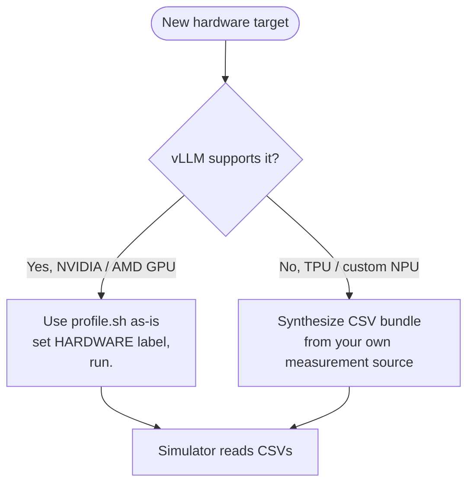

# Adding new hardware

This page is the workflow for bringing up a brand-new hardware target
that doesn't have a profile bundle in `profiler/perf/<HARDWARE>/`
yet. There are two distinct paths depending on whether vLLM supports
the hardware:



The CSV bundle format described on **[Output bundle](./output-bundle)**
is the contract. Once you produce one, the simulator works the same
way regardless of how the data was collected.

## Adding a new GPU

This is the easy case. The profiler's vLLM-based workflow already
handles it. Three steps:

### 0. Measure the machine

```bash
python -m profiler hardware --hardware <LABEL> --npus 2
```

The command defaults to INFO logging; no verbosity flag is required.
Use `--log-level DEBUG`, `INFO`, `WARNING` or `ERROR` to override it.
Invalid levels are rejected before probing the GPU.

Writes `profiler/perf/<LABEL>/hardware.yaml`: the card's spec, queried from the
device, and NCCL AllReduce, AllGather and ReduceScatter sweeps used to fit
shared `link_bw` / `link_latency` parameters for the analytical backend,
plus per-operation bandwidths at the shared fitted latency.
Cluster configs on this hardware then inherit those instead of carrying a
guess, and every inherited value is logged with its provenance
(`measured` / `spec` / `assumed`).

Do this first — it characterises the machine, not a model, and the same file
serves every model bundle in the folder. Re-measure after interconnect or
communication-software changes.

**It needs two of the cards.** With one, the spec section is still written,
`interconnect` is `null` with the reason, and the command exits non-zero; a
cluster config then has to set `link_bw` and `link_latency` explicitly. That is
the honest outcome: a link has two ends, and the simulator will not substitute
a number nobody measured.

#### Calibration contract

The fit models a **single-chunk Ring in one local dimension on a one-hop
FullyConnected topology**. It uses the actual measured rank count `N`.
The raw `samples[].bytes` field, denoted `S` below, has these meanings:

| Collective | `S` means | Ring message bytes `C` | Network phases `P` | Reduction steps `R` |
| --- | --- | --- | --- | --- |
| AllReduce | Full input per rank | `floor(S/N)` | `2(N-1)` | `N-1` |
| AllGather | Local input per rank | `S` | `N-1` | `0` |
| ReduceScatter | Local output per rank; input is `N*S` | `S` | `N-1` | `N-1` |

The prediction, in nanoseconds, follows `Ring.cc`, `PacketBundle.cc`,
`MemBus.cc` and the analytical network backend:

```text
time_ns = P * floor(L + C * 1e9 / (B * 2^30))
        + 3 * R * floor(C / M)
        + (P + 1) * E
```

`B` is network bandwidth in **GiB/s**; `L` is link latency in ns.
`M` is local-memory bandwidth in decimal **GB/s**, using the integer spec
value that `config_builder.py` supplies to ASTRA. `E` is the local endpoint
event cost defined by the backend's `MemBus::Transmition::Fast` path.
The local reduction and endpoint terms are accounted for separately, not
mistaken for network transmission. At two ranks, AllReduce pays two network
phases but AllGather and ReduceScatter pay only one.

The fitter minimises relative squared error over the primitive sweep, with
nonnegative latency and inverse bandwidth. It uses the continuous network
term to solve the two-variable fit; saved residuals use the serialized
parameters and the backend's integer-nanosecond truncation. No model benchmark
or model-specific correction coefficient participates.

The hardware file retains raw graphed and isolated timings, the timing source,
fit version and assumptions, and per-size/per-collective residuals. The legacy
key `bandwidth_gbps` is retained, but `bandwidth_unit: GiB/s` makes its actual
unit explicit. Inherited defaults also record their units.

A retained-data bandwidth refresh can instead hold an independently calibrated
latency fixed. The bundled post-configuration-change RTXPRO6000 calibration uses
that contract: the existing 6,600 ns common latency is retained, and common and
per-operation bandwidths are recomputed from NCCL primitives. Its file records
`fixed_latency_ns`, the source of that constraint, repetitions and residuals.
This is not the same optimization as a fresh `profiler hardware` run, which
estimates both common parameters. Do not silently relabel one as the other.

Historical examples can pin their original transport values with explicit
`link_bw`, `link_latency` and `collective_links: {}`. Their compute profiles and
benchmark truths then remain comparable when shared hardware defaults change.

The same primitive samples also feed `collective_fits`: one bandwidth fit
per operation, with latency fixed to the saved shared fit. This solves the
remaining one-variable problem in inverse bandwidth using the same relative
objective and local costs. Per-operation residuals remain visible; a fit that
cannot identify positive finite bandwidth records `unavailable` rather than
publishing a value. The shared fit is retained as the fallback.

Usable operation fits populate `defaults.collective_links.<operation>.link_bw`.
The bundled RTXPRO6000 Qwen3-32B TP2 and Qwen3-30B DP2/EP2 examples consume
these values directly, with recorded NCCL references for that interconnect.
They are inherited when the entire link is inherited, not when a user specifies
a hypothetical common link. An explicit `collective_links` map can override
bandwidth and latency or disable the operation defaults. See the
[configuration precedence](../reference/cluster-config#collective-specific-links).
Updating code alone does not add these values to existing hardware files.

:::caution[Calibration is not an exact NCCL model]

A shared BW/latency pair need not match all three NCCL curves. Inspect the
residuals rather than assuming a successful fit proves accuracy. Different
rank counts, topologies, dataset splitting or local-memory overrides change
the model contract. Grouped multi-tensor MoE dispatch, uneven rank sizes and
their broadcast/reduce implementations are **not measured by this primitive
sweep**; summing bytes does not reproduce their execution costs.

Updating profiler code does not migrate existing `hardware.yaml` values.
Old fit residuals do not certify the corrected backend contract. Refit retained
raw samples with their original rank count and hardware spec, or re-measure,
then validate before adopting new defaults.

:::

### 1. Confirm vLLM support

The profiler runs vLLM `0.28.0` by default
(`scripts/docker-vllm.sh` pulls `vllm/vllm-openai:v0.28.0`). Check
that vLLM's release notes mention your GPU.

| GPU family | Image/backend notes |
| --- | --- |
| NVIDIA A100, H100, H200 | Yes |
| NVIDIA RTX PRO 6000, RTX 6000 Ada, L40S | Yes |
| NVIDIA Blackwell (B100, B200) | Yes (with the CUDA 12.9 image: `v0.28.0-cu129`) |
| NVIDIA Hopper SXM | Yes |
| AMD MI300X | Yes (ROCm path; needs `vllm/vllm-rocm`) |
| AMD MI200 / older | Limited; check vLLM matrix |
| Intel Gaudi 3 | Limited (HPU plugin); not supported by this profile path |

If vLLM doesn't support it yet, you have two options: wait for vLLM
to add support, or contribute the backend to vLLM upstream. Neither
is fast.

### 2. Edit `profile.sh`

```bash
HARDWARE="H100"                 # or whatever you want as the folder name
TP_DEGREES="1,2,4,8"
MEASUREMENT_ITERATIONS=3
# ... other knobs as needed
```

`HARDWARE` is just a label, pick something memorable. The simulator
later references this via `cluster_config.hardware`.

For unusual GPU types, you may need to adjust:

- `MAX_NUM_BATCHED_TOKENS` and `MAX_NUM_SEQS` for memory limits
- `ATTENTION_MAX_KV` if KV cache memory is much smaller than HBM
  GPUs of similar generation
- `DTYPE` if the GPU lacks bf16 support (rare on modern GPUs)

### 3. Run

```bash
./profiler/profile.sh
```

Wait. Drink coffee. Output lands in
`profiler/perf/<HARDWARE>/<MODEL>/<variant>/`. See
**[Running → Expected runtime](./running#expected-runtime)** for
ballpark times.

Once it's done, the simulator is ready to use, no further changes.
Update your `cluster_config.json` to set `"hardware": "<HARDWARE>"`
and run.

### AMD ROCm notes

The official `vllm/vllm-rocm` Docker image is the AMD equivalent.
Edit `scripts/docker-vllm.sh` to pull that image instead of
`vllm/vllm-openai`. Beyond the image swap, the profile workflow is
identical.

`HARDWARE="MI300X"` (for example): pick whatever makes sense.

## Adding non-GPU hardware

This is the more involved case. The vLLM-based profiler doesn't
work for hardware vLLM doesn't run on (TPU, Intel Gaudi without HPU
support, custom NPUs / accelerators). But the simulator only cares
about the **CSV bundle format**, not how the data was produced.

The strategy: synthesize CSVs in the
[Output bundle](./output-bundle) format from your own measurement
source.

### Three sources for the data

#### 1. Vendor analytical / cycle-accurate model

Most vendors maintain an internal performance model for their
hardware. If you have access:

- Use the vendor's model to compute kernel-level latencies for the
  layer types the simulator's architecture YAML declares
  (`qkv_proj`, `attention`, `down_proj`, etc.).
- Sweep the same axes the GPU profiler does
  (`tokens`, `(prefill_chunk, kv_prefill, n_decode, kv_decode)`,
  `(tokens, activated_experts)`).
- Write CSVs in the schema documented on
  **[Output bundle](./output-bundle)**.

This produces the most accurate simulator predictions because the
relative latencies between layers reflect your hardware's actual
behavior.

#### 2. External simulator

If you have an analytical compute simulator (GEMM-perf, roofline,
or a cycle-accurate model from a published paper), feed it the
shapes the profiler would have profiled and dump the same CSV format.

The architecture YAMLs at `profiler/models/<model_type>.yaml`
declare which kernels you need to time. For each entry in the
`catalog:` section you need:

- For `dense` category: latency as a function of `tokens`.
- For `per_sequence`: latency as a function of `sequences`.
- For `attention`: 4D table over `(prefill_chunk, kv_prefill,
  n_decode, kv_decode)`.
- For `moe`: 2D table over `(local_tokens, activated_experts)`.

#### 3. Hand-authored from datasheets / public benchmarks

Last resort. If you only have peak FLOPs / memory bandwidth /
latency numbers for your hardware:

1. Compute roofline-style latencies per layer type.
2. Write the CSVs. Keep it coarse, a few rows per axis is enough
   for first-pass sanity checks.
3. Validate against any public benchmark you can find for the same
   hardware × model combo.

This produces optimistic predictions (no realistic kernel overhead),
so use cautiously. The other two paths are strongly preferred.

### What to put in `meta.yaml`

Even when synthesizing, write a `meta.yaml` so the simulator's
runtime warnings work properly:

```yaml
profiler_version: "synthetic-v1"
vllm_version: "n/a"
gpu: "<driver device name, or n/a>"
hardware: "<HARDWARE>"          # must equal the folder name
variant: "<VARIANT>"
model: "<org>/<name>"
tp_degrees: [1]
profiled_at: "<date>"

engine_effective:
  max_num_batched_tokens: <whatever your CSVs cover>
  max_num_seqs: <ditto>

skew_fit:
  enabled: false                # no measured heterogeneous correction
```

Do not supply guessed inline alpha coefficients or invent `runtime-skew-calibration-v1` entries or their hashes:
generate them from measured skew data and matching attention references with
`profiler refit-skew`. See [Skew & alpha fit](./skew-alpha-fit).

`hardware` is the folder name a cluster config's `hardware` field must
match; `gpu` is free-form provenance. They are separate fields — don't
put the label in both.

`engine_effective` takes only the two batching bounds; there is no
`dtype` / `kv_cache_dtype` key there, since the dtypes are encoded in
`variant`. Only those two are read, and only to emit the
sweep-bound warning.

`attention_grid` and `skew_profile` are provenance for humans and are
**not read at run time**, so you can omit them from a synthetic bundle
or fill them in however you like.

:::warning[Enable only measured, compiled calibration]
An absent or disabled `skew_fit` applies zero correction. Enabled entries
must use the versioned compiler output; the old constant-alpha and bucket
formats are rejected. `profiler refit-skew` compiles your own raw measurements
against matching attention references. A missing TP or query slice does not
borrow another slice's correction.
:::

Omit `skew.csv` and `skew_fit.csv` when you have no
heterogeneous-decode measurements.

### What you can skip

- `skew.csv` and `skew_fit.csv` if you don't have heterogeneous-decode
  data — see the warning above about what that costs you.
- `moe.csv` if you're not modeling MoE on this hardware (only needed
  when running MoE models).
- `tp<N>/` folders for TP degrees you don't need to simulate. Note the
  mechanism: `_load_perf_db` loads **every** `tp*/` folder it finds and
  then checks that the ones your cluster config needs are among them.
  A missing one is a hard error, not a fallback:

  ```text
  FileNotFoundError: No profile data for tp=[4] under
  perf/<hw>/<model>/<variant>/. Re-run the profiler with TP_DEGREES
  including 4.
  ```

### What you cannot skip

- `dense.csv`: every model uses dense linears.
- `per_sequence.csv`: `lm_head` and `sampler` always run.
- `attention.csv`: every model has attention.
- `meta.yaml`: without it the simulator can't resolve the variant.

### Validation

Once you've synthesized a CSV bundle:

1. **Smoke test**: run the simulator with a small workload
   (`workloads/example_trace.jsonl`) and a single-instance config
   pointing at your new `HARDWARE`.
2. **Compare against a known reference**: if your hardware has
   published latency numbers for a public model, run a workload that
   matches and check TTFT / TPOT match within reason.
3. **Sanity-check the throughput log**: the per-iteration `prompt_t`
   and `decode_t` values should make rough sense (not 10× too high
   or too low).
4. **Watch for the "extrapolation" warning** at startup. If your
   CSVs are too coarse, the simulator warns; densify the relevant
   axes if accuracy matters.

## Where this gets used

Once your CSV bundle lives at
`profiler/perf/<HARDWARE>/<MODEL>/<variant>/`, the simulator picks
it up automatically when the cluster config names matching values:

```json
{
  "hardware": "<HARDWARE>",
  "model_name": "<MODEL>",
  "tp_size": <N>
}
```

The `--dtype` and `--kv-cache-dtype` CLI flags resolve to the right
`<variant>` folder via `resolve_variant()` (see
**[Simulator → Trace generation](/docs/simulator/trace-generation#variant-resolution)**).

## What's next

- **[Output bundle](./output-bundle)**: schema reference for what
  you need to produce (or have the profiler produce).
- **[Adding a model architecture](./adding-model-architecture)** -
  separate concern, only when the model's `model_type` isn't
  already in `profiler/models/`.
