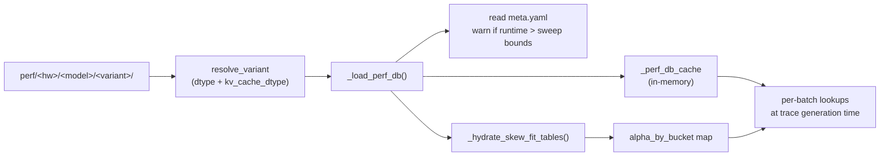

# Output bundle

Each profile run produces a directory tree under
`profiler/perf/<HARDWARE>/<MODEL>/<variant>/`. This is **the contract
between the profiler and the simulator**: anything that lands here
in the right format is consumable by
`trace_generator._load_perf_db()`, regardless of how it was produced.

## Folder layout

```
profiler/perf/<HARDWARE>/<MODEL>/<variant>/
├── meta.yaml
└── tp<N>/                        # one folder per profiled TP degree
    ├── dense.csv
    ├── per_sequence.csv
    ├── attention.csv
    ├── moe.csv                   # MoE models only
    ├── skew.csv                  # skew-enabled runs only
    └── skew_fit.csv              # skew-enabled runs only
```

`<variant>` is auto-named from the dtype combination
(`bf16`, `bf16-kvfp8`, `fp8-kvfp8`, …): see
**[Running → Output naming](./running#output-naming)**. Multiple
variants for the same hardware × model live as siblings.

`tp<N>/` exists for each TP in `TP_DEGREES`. Layers tagged
`tp_stable: true` in the architecture YAML (layernorms, sampler) are
profiled once at TP=1 and **replicated** into other TP folders by the
writer.

## Times are microseconds

All `time_us` columns are in **microseconds**. The simulator
multiplies by 1000 and rounds to nanoseconds at load time. If you're
hand-authoring CSVs (see [Adding non-GPU hardware](./adding-hardware#adding-non-gpu-hardware)),
remember to use μs.

## `dense.csv`

```
layer,tokens,time_us
act_fn,1,4.21367
act_fn,2,5.36533
...
qkv_proj,1,20.4373
qkv_proj,2,20.4813
...
```

| Column | Meaning |
| --- | --- |
| `layer` | Canonical layer name (must match the architecture YAML's catalog) |
| `tokens` | `total_len` for this shot |
| `time_us` | Measured kernel latency, microseconds |

The simulator does **1D linear interpolation over `tokens`** when
looking up.

Layers it covers: `embedding`, `layernorm`, `qkv_proj`, `qk_norm`,
`rotary_emb`, `o_proj`, `gate_up_proj`, `act_fn`, `down_proj`,
`final_layernorm`. (Anything in the YAML's catalog with category
`dense`.)

## `per_sequence.csv`

```
layer,sequences,time_us
lm_head,1,1075.13
lm_head,2,1044.52
...
sampler,1,25.9333
...
```

| Column | Meaning |
| --- | --- |
| `layer` | `lm_head` or `sampler` |
| `sequences` | `num_requests` for this shot (decode rounds operate per-sequence) |
| `time_us` | Measured kernel latency |

Simulator: **1D linear interpolation over `sequences`**.

## `attention.csv`

The 4D attention table, covers pure-prefill, pure-decode, and mixed
kernel shapes:

```
prefill_chunk,kv_prefill,n_decode,kv_decode,time_us
0,0,1,16,8.08533
0,0,1,32,8.17033
...
512,2048,4,128,...
...
```

| Column | Meaning |
| --- | --- |
| `prefill_chunk` | Tokens of the prefill chunk in this iteration. `0` = pure decode |
| `kv_prefill` | KV cache history length the prefill chunk attends to |
| `n_decode` | Number of concurrent decode requests in this iteration. `0` = pure prefill |
| `kv_decode` | KV cache history length the decode requests attend to |
| `time_us` | Measured attention kernel latency |

Simulator does **4D linear interpolation**: each of the four axes is
bracketed by its two neighbouring profiled values and blended
linearly, extrapolating from the top two samples above the grid.

The grid is geometric (doubling by default, controlled by
`ATTENTION_CHUNK_FACTOR` and `ATTENTION_KV_FACTOR`). Smaller values
densify; larger values speed up profiling at some accuracy cost.

## `moe.csv` (MoE models only)

```
tokens,activated_experts,time_us
1,8,50.2297
2,8,56.1917
...
```

| Column | Meaning |
| --- | --- |
| `tokens` | Local tokens on a single rank after dispatch |
| `activated_experts` | Distinct experts touched on that rank |
| `time_us` | Measured MoE block latency on a single rank |

Simulator: **2D linear interpolation** on `(tokens, activated_experts)`.
Profiled at **TP=1** only, increasing TP doesn't change the
per-rank expert kernel. The simulator handles `ep_size` by adjusting
expert-to-rank assignment, not by re-profiling.

## `skew.csv` (skew-enabled runs)

Raw heterogeneous-decode shots:

```
regime,n,nb,ratio,skew,pc,kp,kvs,kv_big,kv_mean,t_mean_us,t_max_us,t_skew_us,alpha
pure,4,1,0.25,4.0,0,0,512,2048,896,74.784,118.88,74.657,-0.0029
pure,4,1,0.25,4.0,0,0,2048,8192,3584,169.854,321.566,171.394,0.0102
...
```

The columns capture the raw shape of each bimodal batch and the
three measurements:

| Column | Meaning |
| --- | --- |
| `regime` | `pure` (decode-only) or `mixed` (with prefill chunk) |
| `n` | Total decodes in the batch |
| `nb` | Number of "big" decodes (the outlier KV bucket) |
| `ratio` | `nb / n` |
| `skew` | Ratio of big-KV to small-KV (`kv_big / kvs`) |
| `pc` | Prefill chunk size |
| `kp` | KV history of the prefill chunk |
| `kvs` | Small-decode KV |
| `kv_big` | Big-decode KV (`kvs * skew`) |
| `kv_mean` | `(nb * kv_big + (n-nb) * kvs) / n` |
| `t_mean_us` | Latency at all-decodes-uniform-at-mean kv |
| `t_max_us` | Latency at all-decodes-uniform-at-max kv |
| `t_skew_us` | Latency at the actual bimodal mix |
| `alpha` | `(t_skew - t_mean) / (t_max - t_mean)`. **Not clamped** — 14-20% of rows are negative and 2-5% exceed 1, as the sample rows above show. `nan` when `t_max <= t_mean`, and the fit drops those |

Methodology: **[Skew & alpha fit](./skew-alpha-fit)**.

## `skew_fit.csv` (skew-enabled runs)

The fitted per-bucket alpha table the simulator actually consumes
at run time:

```
pc,n_label,skew_rate_label,kv_big_label,kp_label,alpha,n_samples
0,n<=128,sr<=15%,kvB<=16k,kp=0,0.0322,4
0,n<=128,sr<=15%,kvB<=1k,kp=0,0.0323,4
...
```

| Column | Meaning |
| --- | --- |
| `pc` | Prefill chunk bucket (raw value) |
| `n_label` | `n_decode` bucket label |
| `skew_rate_label` | Skew-rate bucket label. The rate itself *is* clipped to [0, 1], unlike alpha — fixed bins `sr<=5%` / `sr<=15%` / `sr<=40%` / `sr<=70%` / `sr>70%` |
| `kv_big_label` | Big-KV bucket (log-4× bins) |
| `kp_label` | `kv_prefill` bucket label |
| `alpha` | Fitted weighted-LS alpha for this bucket |
| `n_samples` | Number of `skew.csv` rows that contributed |

Labels are the human-readable comparison strings the fitter emits
(`n<=128`, `kvB<=4k`, `kp=0`), not slugs — the simulator rebuilds them
from `meta.yaml::skew_fit.bucket_axes` and joins them into the key
`pc={pc}|{n_label}|{sr_label}|{kvb_label}|{kp_label}`, so they have to
match character for character.

Because the axes are recorded in the meta rather than hardcoded,
widening the profile sweep lights up finer resolution with no
simulator-side change: `n` and `kp` get one bin per unique profiled
value, and `kv_big` extends its log-4x bins to the observed maximum.

## `meta.yaml`

Sibling of the `tp<N>/` folders. Below is a real one, from
`profiler/perf/RTXPRO6000/Qwen/Qwen3-32B/bf16/`, with the per-TP fit
block trimmed to one entry:

```yaml
profiler_version: 1.0.0
vllm_version: 0.19.0
cuda_version: '13.0'
gpu: NVIDIA RTX PRO 6000 Blackwell Server Edition
hardware: RTXPRO6000
profiled_at: '2026-04-24T12:35:08+00:00'
architecture: qwen3
architecture_sha256: c0557f326f38c70b46b5841c90d3447863d653dc9a228019db74eec591c2bf78
model: Qwen/Qwen3-32B
variant: bf16
tp_degrees: [1, 2]
engine_effective:
  load_format: dummy
  enforce_eager: true
  skip_tokenizer_init: true
  enable_prefix_caching: false
  generation_config: vllm
  tensor_parallel_size: 1
  block_size: 16
  gpu_memory_utilization: 0.9
  max_num_batched_tokens: 2048
  max_num_seqs: 256
  hf_overrides:
    num_hidden_layers: 1
    intermediate_size: 12800
    num_attention_heads: 32
    num_key_value_heads: 4
    vocab_size: 75968
  worker_extension_cls: profiler.hooks.extension.Extension
  model: /tmp/profiler_model_dnlix5xf
attention_grid:
  max_kv: 16384
  chunk_factor: 2.0
  kv_factor: 2.0
  chunks: 0, 16-2048 x2
  n_decode: 0, 1-256 x2
  kv: 0, 16-16384 x2
measurement_iterations: 3
skew_profile:
  enabled: true
  factors: {n: 2.0, pc: 2.0, kp: 2.0, kvs: 2.0}
  grid:
    n: 2-256 x2
    ratio: [0.0625, 0.125, 0.25, 0.5, 0.75, 0.9]
    pc: 0, 16-2048 x2
    kp: 0, 512-8192 x2
    kvs: 128-16384 x2
    skew_rep: 4.0
skew_fit:
  enabled: true
  bucket_axes:
    pc: raw pc value (profiled grid point)
    n_bins: [0, 2, 4, 8, 16, 32, 64, 128, 256, 1000000]
    n_labels: [n<=2, n<=4, n<=8, n<=16, n<=32, n<=64, n<=128, n<=256, n>256]
    skew_rate_bins: [-0.01, 0.05, 0.15, 0.4, 0.7, 1.01]
    skew_rate_labels: [sr<=5%, sr<=15%, sr<=40%, sr<=70%, sr>70%]
    kv_big_bins: [0, 1024, 4096, 16384, 1000000000]
    kv_big_labels: [kvB<=1k, kvB<=4k, kvB<=16k, kvB>16k]
    kp_bins: [-1, 0, 512, 1024, 2048, 4096, 8192, 1000000000]
    kp_labels: [kp=0, kp<=512, kp<=1k, kp<=2k, kp<=4k, kp<=8k, kp>8k]
  per_tp:
    1:
      method: per_bucket_wls_5axis
      n_samples: 13016
      alpha_default: 0.057
      bucket_table: tp1/skew_fit.csv
      rel_err_p50: 0.0121
      rel_err_p90: 0.0609
      rel_err_p99: 0.3578
      signed_mean: 0.005
```

### Identity and provenance

| Key | Meaning |
| --- | --- |
| `profiler_version` / `vllm_version` / `cuda_version` | Versions the bundle was produced with. Kernel timings shift a few percent across CUDA driver versions, so this is the field to check before trusting a mixed comparison |
| `gpu` | The **driver's** device name, verbatim |
| `hardware` | The `--hardware` label, i.e. the folder name and the value a cluster config's `hardware` field must match. Distinct from `gpu` |
| `architecture` / `architecture_sha256` | Which `profiler/models/*.yaml` was used, and its hash — so you can tell whether a catalog edit invalidates the bundle |
| `model` / `variant` / `tp_degrees` | What was profiled |
| `measurement_iterations` | Timed forwards averaged per shot |

### `engine_effective`

The engine kwargs vLLM actually ran with, not what was requested.
Notable entries:

- `max_num_batched_tokens` / `max_num_seqs` — the **logical** values.
  The engine is booted with `max_num_batched_tokens + max_num_seqs` for
  shot-bypass headroom, and the bump is subtracted back before
  recording, so what you see here is the sweep bound.
- `hf_overrides` — how single-GPU TP emulation is done: per-rank shapes
  divided by the TP degree, plus `num_hidden_layers: 1` since one block
  is enough to time a layer.
- `load_format: dummy` — weights are never loaded; only shapes matter.
- `model` — the tmpdir the model config was written to, so vLLM needed
  no Hub access. The path is dead after the run.

There is no `dtype` or `kv_cache_dtype` key here. The effective dtypes
are encoded in `variant`.

### Grid specs are compact, not enumerated

`attention_grid` and `skew_profile.grid` use a shorthand rather than
listing every point:

| Spec | Reads as |
| --- | --- |
| `0, 16-2048 x2` | the value `0`, then `16` doubling to `2048` |
| `2-256 x2` | `2` doubling to `256`, no zero point |
| `[0.0625, 0.125, …]` | an explicit list, used where the axis is not geometric |

`skew_profile.grid.skew_rep` is the single representative skew factor
Tier 1 fires at (`4.0`); the Tier 2 anchor sweep's skew values are not
recorded here.

### What the simulator actually reads

| Key | Used for |
| --- | --- |
| `engine_effective.max_num_batched_tokens` / `.max_num_seqs` | One-shot warning when the runtime CLI exceeds the sweep bounds, since lookups will extrapolate |
| `skew_fit.enabled` | Whether to apply any skew correction at all |
| `skew_fit.bucket_axes` | Building the bucket key per batch. Falls back to module defaults for bundles written before these were recorded |
| `skew_fit.per_tp[tp].alpha_by_bucket` or `.bucket_table` | The alpha table, hydrated from `tp<N>/skew_fit.csv` when the meta points at a CSV |
| `skew_fit.per_tp[tp].alpha_default` | Fallback for a bucket absent from the table |

Everything else — versions, `gpu`, `architecture_sha256`,
`attention_grid`, `skew_profile`, and the `rel_err_*` / `signed_mean`
fit diagnostics — is provenance for humans and is not consumed at run
time.

## How the simulator consumes this



For the simulator-side mechanics, see
**[Simulator → Trace generation](/docs/simulator/trace-generation)**.

## Gotchas

1. **Don't edit CSVs by hand to "tune" simulation results.** The
   simulator interpolates linearly across rows; bogus values produce
   non-monotonic behavior that's hard to debug.
2. **`time_us` is microseconds.** A common mistake when synthesizing
   CSVs from external tools is to put nanoseconds. Triple-check.
3. **Layer names in `dense.csv` must match the architecture YAML.**
   If you add a layer to the YAML and don't profile it, the
   simulator one-shot-warns (and uses 0 latency for that layer,
   silently corrupting results). Re-run profile after YAML edits.
4. **`tp<N>/` folders aren't symlinks.** TP-stable layers are
   physically copied by the writer. Editing `tp1/dense.csv` doesn't
   propagate to `tp2/`.

## What's next

- **[Skew & alpha fit](./skew-alpha-fit)**: methodology behind
  `skew.csv` and `skew_fit.csv`.
- **[Adding non-GPU hardware](./adding-hardware#adding-non-gpu-hardware)**
  synthesize this CSV bundle from your own measurement source.
