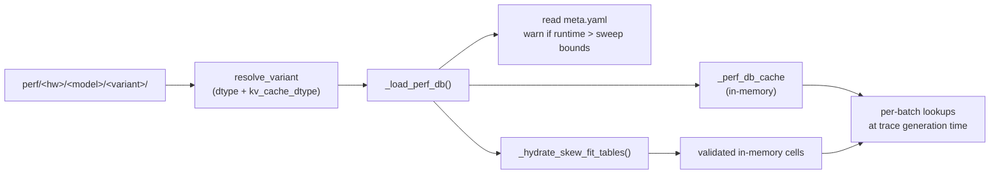

# Output bundle

Each profile run produces a directory tree under
`profiler/perf/<HARDWARE>/<MODEL>/<variant>/`. This is **the contract
between the profiler and the simulator**: anything that lands here
in the right format is consumable by
`trace_generator._load_perf_db()`, regardless of how it was produced.

## Folder layout

```
profiler/perf/<HARDWARE>/
├── hardware.yaml                 # the card's spec + the measured interconnect;
│                                 # one per hardware folder, shared by every model
└── <MODEL>/<variant>/
    ├── meta.yaml
    └── tp<N>/                    # one folder per profiled TP degree
        ├── dense.csv
        ├── per_sequence.csv
        ├── attention.csv
        ├── linear_attention.csv  # mamba / gated-DeltaNet models only
        ├── moe.csv               # MoE models only, one grid per EP degree
        ├── skew.csv              # skew-enabled runs only
        └── skew_fit.csv          # skew-enabled runs only
```

`<variant>` is auto-named from the dtype combination
(`bf16`, `bf16-kvfp8`, `fp8-kvfp8`, …): see
**[Running → Output naming](./running#output-naming)**. Multiple
variants for the same hardware × model live as siblings.

`tp<N>/` exists for each TP in `TP_DEGREES`. Layers tagged
`tp_stable: true` in the architecture YAML (layernorms, sampler) are
profiled once at TP=1 and **replicated** into other TP folders by the
writer.

`hardware.yaml` sits one level up because it answers a different question. The
CSVs are per **(model, hardware)**; the interconnect and the card's memory are
per **hardware**, so one file serves every model bundle underneath. Written by
`python -m profiler hardware`, and read by cluster configs that omit
`link_bw` / `link_latency` / `npu_mem.*` — see
**[Cluster config schema](../reference/cluster-config)**.

## Times are microseconds

All `time_us` columns are in **microseconds**. The simulator
multiplies by 1000 and rounds to nanoseconds at load time. If you're
hand-authoring CSVs (see [Adding non-GPU hardware](./adding-hardware#adding-non-gpu-hardware)),
remember to use μs.

## `dense.csv`

```
layer,tokens,time_us
act_fn,1,4.21367
act_fn,2,5.36533
...
qkv_proj,1,20.4373
qkv_proj,2,20.4813
...
```

| Column | Meaning |
| --- | --- |
| `layer` | Canonical layer name (must match the architecture YAML's catalog) |
| `tokens` | `total_len` for this shot |
| `time_us` | Measured kernel latency, microseconds |

The simulator does **1D linear interpolation over `tokens`** when
looking up.

Layers it covers: `embedding`, `layernorm`, `qkv_proj`, `qk_norm`,
`rotary_emb`, `o_proj`, `gate_up_proj`, `act_fn`, `down_proj`,
`final_layernorm`. (Anything in the YAML's catalog with category
`dense`.)

## `per_sequence.csv`

```
layer,sequences,time_us
lm_head,1,1075.13
lm_head,2,1044.52
...
sampler,1,25.9333
...
```

| Column | Meaning |
| --- | --- |
| `layer` | `lm_head` or `sampler` |
| `sequences` | `num_requests` for this shot (decode rounds operate per-sequence) |
| `time_us` | Measured kernel latency |

Simulator: **1D linear interpolation over `sequences`**.

## `attention.csv`

The attention table covers pure-prefill, pure-decode, and mixed
kernel shapes:

```
layer,prefill_chunk,prefill_key,n_decode,kv_decode,decode_q_len,time_us
attention,0,0,1,16,1,8.08533
attention,0,0,1,32,1,8.17033
...
attention,512,2304,4,128,1,...
...
```

| Column | Meaning |
| --- | --- |
| `prefill_chunk` | Tokens of the prefill chunk in this iteration. `0` = pure decode |
| `prefill_key` | Query-weighted effective causal key length across prefills |
| `n_decode` | Number of concurrent decode requests in this iteration. `0` = pure prefill |
| `kv_decode` | KV cache history length the decode requests attend to |
| `decode_q_len` | Query tokens per decode sequence; normally 1, larger for speculative verification |
| `time_us` | Measured attention kernel latency |

For chunks `c_i` with histories `k_i`, the shared profiling/runtime coordinate
is `sum(c_i * (k_i + c_i / 2)) / sum(c_i)` (zero without prefills). Equal
chunks and single-request shots keep their previous values. Legacy
`kv_prefill` tables held one prefill per shot and are relabelled on load as
`kv_prefill + prefill_chunk / 2`; this does not create missing grid coverage.

Simulator does **5D linear interpolation**: each populated axis is
bracketed by its two neighbouring profiled values and blended
linearly, extrapolating from the top two samples above the grid.

The grid is geometric (doubling by default, controlled by
`ATTENTION_CHUNK_FACTOR` and `ATTENTION_KV_FACTOR`). Smaller values
densify; larger values speed up profiling at some accuracy cost.

## `linear_attention.csv` (mamba / gated-DeltaNet models only)

| Column | Meaning |
| --- | --- |
| `layer` | Canonical layer name |
| `prefill_tokens` | Tokens in the batch's prefill chunk |
| `n_decode` | Number of decoding sequences |
| `time_us` | Latency for one trace node, microseconds |

Two axes rather than attention's four, and no kv axis at all: a
gated-DeltaNet layer keeps a fixed-size conv state and a fixed-size recurrent
state per sequence, neither a function of position. Cost therefore does not
depend on sequence length — measured on Qwen3.8-27B, a 64x spread in kv length
moves it 1.1% — and **no skew correction applies**, unlike `attention.csv`.

Two axes rather than one because *which kernel runs* depends on the mix. A
pure-decode batch runs a recurrent kernel; add a prefill chunk and vLLM
switches to a fused-gating one, and the conv switches too. That is why this
file has a `layer` column where `attention.csv` does not: one block runs
several non-interchangeable kernels on the same axes, so each gets its own
rows, and a cell is empty when the batch shape never reaches that kernel.

The `prefill_tokens` axis is sampled **chunk-aware** — inside the first chunk,
at every chunk boundary, and at the token just past each boundary. Cost is a
staircase, not a line: one token past a 64-boundary costs 13.5% more than the
boundary itself, and the interval to the next boundary is nearly flat. A plain
geometric grid lands only on boundaries, so interpolating between two samples
underestimates most of the token counts a chunked-prefill scheduler actually
produces.

## `moe.csv` (MoE models only)

```
ep,tokens,activated_experts,time_us
1,1,8,47.8
2,1,4,36.1
4,1,2,30.2
...
```

| Column | Meaning |
| --- | --- |
| `ep` | EP degree this grid was measured at — the engine ran `E/ep` local experts and `k/ep` assignments per token |
| `tokens` | Local tokens on a single rank after dispatch |
| `activated_experts` | Distinct experts touched on that rank |
| `time_us` | Measured MoE block latency on a single rank |

Simulator: **2D linear interpolation** on `(tokens, activated_experts)`
within the grid for this instance's total EP degree. An unprofiled degree
falls back to the nearest with a one-shot warning rather than interpolating
across `ep` — `E/ep` has to be a whole number of experts and the permute width
is a staircase in it.

**One grid per EP degree, because a rank runs a slice and not the block.**
It permutes over `E/ep` local experts rather than all E, a token contributes
`k/ep` of its k expert assignments rather than all k, and so the distinct
experts it activates start at `k/ep` rather than at `top_k`. Profiling only at
ep=1 gets all three wrong in the same direction, and the third one is not even
interpolated: `activated_experts` is the one lookup axis whose minimum is a
positive number the runtime goes under, and the lookup clamps below the grid.
Measured at one token on the rank:

| model | ep=1 | ep=8 (a real rank at EP=8) |
| --- | --- | --- |
| DeepSeek-V3.2 | 84.7 us | **28.1 us** |
| GLM-5 | 162.6 us | **33.7 us** |
| MiniMax-M3 | 139.5 us | **47.3 us** |
| Qwen3-30B-A3B | 47.8 us | **27.8 us** |

Sweep it with `--moe-ep-degrees 1,2,4,8` (or `MOE_EP_DEGREES` in
`profile.sh`) whenever the deployment runs EP > 1. Each degree past 1 costs one
engine boot and the same ~57 shots — about 10 minutes for a full sweep. A
bundle with no `ep` column is read as ep=1 and prices exactly as it did before
the axis existed.

Still profiled at **TP=1**: expert weights shard by `ep_size`, not `tp_size`.


## `skew.csv` (skew-enabled runs)

One raw measurement per attention-category kernel and ordered request shape.
The built-in bimodal sweep retains `n, nb, ratio, skew, pc, kp, kvs, kv_big,
kv_mean` plus measured `t_mean_us, t_max_us, t_skew_us` and the diagnostic
control-based `alpha`. Raw alpha is not clipped.

New rows also carry:

| Column | Meaning |
| --- | --- |
| `layer` | Exact attention-category kernel |
| `requests_json` | Ordered `[query_tokens, computed_history_tokens]` pairs |
| `decode_q_len` | Query tokens per decode request |
| `case_id` | Geometry-derived resume key; the compiler recomputes it |

General distributions require the complete request list. A multi-query input
also needs an explicit `n_prefill` role boundary; current acquisition emits
q=1. Legacy bimodal rows without these additions remain reconstructible.

The default fit uses measured `t_skew_us` as its target, but **recomputes**
mean/max references from `attention.csv` through serving's lookup. It does not
reuse the diagnostic raw alpha or overwrite measured controls with estimates.

## `skew_fit.csv` (skew-enabled runs)

New fits use `runtime-skew-calibration-v1` and write:

```text
layer,decode_q_len,pc_label,lev_label,n_anchor,alpha,direct_rows,pooled_rows
```

| Column | Meaning |
| --- | --- |
| `layer`, `decode_q_len` | Separate kernel/query slice; no cross-slice borrowing |
| `pc_label`, `lev_label` | Prefill-token and relative-reference-gap partition |
| `n_anchor` | Measured decode count with enough direct support in this partition |
| `alpha` | Clipped relative-latency weighted median |
| `direct_rows` | Distinct supported cases at the anchor itself |
| `pooled_rows` | Direct cases plus nearby unsupported-N cases pooled into this anchor |

The simulator picks the nearest supported N on a log scale, with lower-anchor
ties. It does not interpolate neighboring alpha values. The support-adaptive
N anchors differ between partitions; prefill/lever bins remain fixed.
See [Skew & alpha fit](./skew-alpha-fit) for the objective and fallback rules.

Each `meta.yaml::skew_fit.per_tp[tp]` entry records the schema, bundle/TP
identity, `axes`, `min_rows`, `alpha_clip`, `n_samples`, dropped-row counts,
`alpha_default_by_kernel`, `n_range_by_kernel`, `reference`, `bucket_table`
and `bucket_table_sha256`. Kernel/query keys have the form `attention|q=1`.
`reference` records attention and raw-skew checksums, the lookup fingerprint
and key-saturation semantics. The fitted CSV contains the cells, not raw shots.

Legacy files have `layer, n_label, pc_label, lev_label, alpha, n_samples`
and no schema field. They continue to use the legacy lookup until
`profiler refit-skew` or a profiler metadata refresh rebuilds them. Do not
combine a versioned CSV with legacy metadata.

## `meta.yaml`

Sibling of the `tp<N>/` folders. Below is a real one, from
`profiler/perf/RTXPRO6000/Qwen/Qwen3-32B/bf16/`, with the per-TP fit
block trimmed to one entry. This is a **legacy, unversioned** bundle;
new calibration entries follow the contract above:

```yaml
profiler_version: 1.0.0
vllm_version: 0.19.0
cuda_version: '13.0'
gpu: NVIDIA RTX PRO 6000 Blackwell Server Edition
hardware: RTXPRO6000
profiled_at: '2026-04-24T12:35:08+00:00'
architecture: qwen3
architecture_sha256: c0557f326f38c70b46b5841c90d3447863d653dc9a228019db74eec591c2bf78
model: Qwen/Qwen3-32B
variant: bf16
tp_degrees: [1, 2]
engine_effective:
  load_format: dummy
  enforce_eager: true
  skip_tokenizer_init: true
  enable_prefix_caching: false
  generation_config: vllm
  tensor_parallel_size: 1
  block_size: 16
  gpu_memory_utilization: 0.9
  max_num_batched_tokens: 2048
  max_num_seqs: 256
  hf_overrides:
    num_hidden_layers: 1
    intermediate_size: 12800
    num_attention_heads: 32
    num_key_value_heads: 4
    vocab_size: 75968
  worker_extension_cls: profiler.hooks.extension.Extension
  model: /tmp/profiler_model_dnlix5xf
attention_grid:
  max_kv: 16384
  chunk_factor: 2.0
  kv_factor: 2.0
  chunks: 0, 16-2048 x2
  n_decode: 0, 1-256 x2
  kv: 0, 16-16384 x2
  decode_q_lens: [1]
category_provenance:
  dense: {vllm_version: 0.19.0, profiled_at: '2026-04-24T12:44:06+00:00'}
  moe: {vllm_version: 0.28.0, profiled_at: '2026-09-03T02:13:24+00:00'}
measurement_iterations: 3
skew_profile:
  enabled: true
  factors: {n: 2.0, pc: 2.0, kp: 2.0, kvs: 2.0}
  grid:
    n: 2-256 x2
    ratio: [0.0625, 0.125, 0.25, 0.5, 0.75, 0.9]
    pc: 0, 16-2048 x2
    kp: 0, 512-8192 x2
    kvs: 128-16384 x2
    skew_rep: 4.0
skew_fit:
  enabled: true
  bucket_axes:
    axes: [n, pc, lev]
    n_bins: [0, 3, 6, 11, 23, 45, 91, 181, 362, 1000000000]
    n_labels: [n=2, n=4, n=8, n=16, n=32, n=64, n=128, n=256, n>256]
    pc_bins: [-1, 1, 256, 1024, 1000000000]
    pc_labels: [pc0, pcS, pcM, pcL]
    lev_bins: [0.0, 0.25, 0.75, 1.5, 3.0, 1000000000.0]
    lev_labels: [lev0, lev1, lev2, lev3, lev4]
  per_tp:
    1:
      method: per_bucket_median_3axis_n_pc_lev
      n_samples: 13476
      alpha_default: 0.0535
      alpha_default_by_layer: {attention: 0.0535}
      bucket_table: tp1/skew_fit.csv
      rel_err_p50: 0.0259
      rel_err_p90: 0.1259
      rel_err_p99: 0.349
      signed_mean: -0.0046
```

### Identity and provenance

| Key | Meaning |
| --- | --- |
| `profiler_version` / `vllm_version` / `cuda_version` | Versions the bundle was produced with. Kernel timings shift a few percent across CUDA driver versions, so this is the field to check before trusting a mixed comparison |
| `gpu` | The **driver's** device name, verbatim |
| `hardware` | The `--hardware` label, i.e. the folder name and the value a cluster config's `hardware` field must match. Distinct from `gpu` |
| `architecture` / `architecture_sha256` | Which `profiler/models/*.yaml` was used, and its hash — so you can tell whether a catalog edit invalidates the bundle |
| `model` / `variant` / `tp_degrees` | What was profiled |
| `measurement_iterations` | Timed forwards averaged per shot |

### `engine_effective`

The engine kwargs vLLM actually ran with, not what was requested.
Notable entries:

- `max_num_batched_tokens` / `max_num_seqs` — the **logical** values.
  The engine is booted with `max_num_batched_tokens + max_num_seqs` for
  shot-bypass headroom, and the bump is subtracted back before
  recording, so what you see here is the sweep bound.
- `hf_overrides` — how single-GPU TP emulation is done: per-rank shapes
  divided by the TP degree, plus `num_hidden_layers: 1` since one block
  is enough to time a layer.
- `load_format: dummy` — weights are never loaded; only shapes matter.
- `model` — the tmpdir the model config was written to, so vLLM needed
  no Hub access. The path is dead after the run.

There is no `dtype` or `kv_cache_dtype` key here. The effective dtypes
are encoded in `variant`.

### Grid specs are compact, not enumerated

`attention_grid.decode_q_lens` lists the query lengths swept. It is recorded
because it cannot be recovered from the rows: a `q > 1` sweep yields no
pure-prefill shot, so the row count alone cannot tell you which query lengths
fired, and a bundle holding five of them while the meta records none reads as
a `q=1` sweep.

`category_provenance` records the vLLM version and timestamp **per category**.
A bundle is not necessarily one measurement session — a `slice` refresh
rewrites one category and leaves the rest — and the top-level `vllm_version` /
`profiled_at` describe only the most recent refresh. Which rows came from which
version is not a detail: vLLM 0.28 restructured MoE, and the two versions agree
to within noise on decode-sized batches while differing by 16–26% at 2048
tokens.

A refresh only rewrites what it measured. `engine_effective` and
`engine_resolved` describe the **deepest main engine**, so a `--profile-mtp`
refresh (which boots a different model — one extra full-attention layer and a
conv state widened by `num_speculative_tokens`) and a per-category refresh
(which boots a shrunk stack) both leave them alone. `attention_grid` may only
be rewritten by a run that swept attention.

`attention_grid` and `skew_profile.grid` use a shorthand rather than
listing every point:

| Spec | Reads as |
| --- | --- |
| `0, 16-2048 x2` | the value `0`, then `16` doubling to `2048` |
| `2-256 x2` | `2` doubling to `256`, no zero point |
| `[0.0625, 0.125, …]` | an explicit list, used where the axis is not geometric |

`skew_profile.grid.skew_rep` is the single representative skew factor
Tier 1 fires at (`4.0`); the Tier 2 anchor sweep's skew values are not
recorded here.

### What the simulator actually reads

| Key | Used for |
| --- | --- |
| `engine_effective.max_num_batched_tokens` / `.max_num_seqs` | One-shot warning when the runtime CLI exceeds the sweep bounds, since lookups will extrapolate |
| `skew_fit.enabled` | Whether to apply any skew correction at all |
| `skew_fit.per_tp[tp].schema` | Versioned calibration or the unversioned legacy path |
| `skew_fit.per_tp[tp].identity`, `.reference`, `.bucket_table_sha256` | Validate bundle identity, attention/reference implementation, saturation contract and table bytes |
| `skew_fit.per_tp[tp].axes`, `.bucket_table` | Load partitions and supported N anchors once |
| `skew_fit.per_tp[tp].alpha_default_by_kernel`, `.n_range_by_kernel` | Same-kernel/query fallback and measured N bounds |
| Legacy `bucket_axes`, `alpha_by_bucket`, `alpha_default_by_layer`, `alpha_default` | Backward-compatible unversioned lookup only |

Other version and acquisition fields describe provenance. Raw skew data is
required for rebuilding, not for runtime lookup. A changed attention table,
lookup implementation, fitted table or saturation contract invalidates new
calibration and requires `profiler refit-skew`.

## How the simulator consumes this


```mermaid
flowchart LR
    PERF["perf/&lt;hw&gt;/&lt;model&gt;/&lt;variant&gt;/"] --> RESOLVE["resolve_variant<br/>(dtype + kv_cache_dtype)"]
    RESOLVE --> LOAD["_load_perf_db()"]
    LOAD --> CACHE["_perf_db_cache<br/>(in-memory)"]
    LOAD --> META["read meta.yaml<br/>warn if runtime &gt; sweep bounds"]
    LOAD --> SKEWHYD["_hydrate_skew_fit_tables()"]
    SKEWHYD --> ALPHA["validated in-memory cells"]
    CACHE --> LOOKUPS["per-batch lookups<br/>at trace generation time"]
    ALPHA --> LOOKUPS
```

For the simulator-side mechanics, see
**[Simulator → Trace generation](/docs/simulator/trace-generation)**.

## Gotchas

1. **Don't edit CSVs by hand to "tune" simulation results.** The
   simulator interpolates linearly across rows; bogus values produce
   non-monotonic behavior that's hard to debug.
2. **`time_us` is microseconds.** A common mistake when synthesizing
   CSVs from external tools is to put nanoseconds. Triple-check.
3. **Layer names in `dense.csv` must match the architecture YAML.**
   If you add a layer to the YAML and don't profile it, the
   simulator one-shot-warns (and uses 0 latency for that layer,
   silently corrupting results). Re-run profile after YAML edits.
4. **`tp<N>/` folders aren't symlinks.** TP-stable layers are
   physically copied by the writer. Editing `tp1/dense.csv` doesn't
   propagate to `tp2/`.

## What's next

- **[Skew & alpha fit](./skew-alpha-fit)**: methodology behind
  `skew.csv` and `skew_fit.csv`.
- **[Adding non-GPU hardware](./adding-hardware#adding-non-gpu-hardware)**
  synthesize this CSV bundle from your own measurement source.
