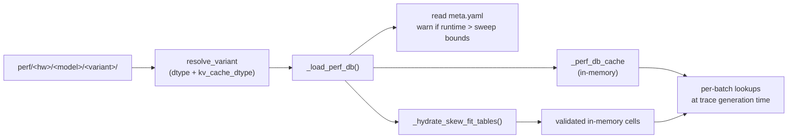

# Output bundle

Each profile run produces a directory tree under
`profiler/perf/<HARDWARE>/<MODEL>/<variant>/`. This is **the contract
between the profiler and the simulator**: anything that lands here
in the right format is consumable by
`trace_generator._load_perf_db()`, regardless of how it was produced.

## Folder layout

```
profiler/perf/<HARDWARE>/
├── hardware.yaml                 # the card's spec + the measured interconnect;
│                                 # one per hardware folder, shared by every model
└── <MODEL>/<variant>/
    ├── meta.yaml
    └── tp<N>/                    # one folder per profiled TP degree
        ├── dense.csv
        ├── per_sequence.csv
        ├── attention.csv
        ├── linear_attention.csv  # mamba / gated-DeltaNet models only
        ├── moe.csv               # MoE models only, one grid per EP degree
        ├── skew.csv              # skew-enabled runs only
        └── skew_fit.csv          # skew-enabled runs only
```

`<variant>` is auto-named from the dtype combination
(`bf16`, `bf16-kvfp8`, `fp8-kvfp8`, …): see
**[Running → Output naming](./running#output-naming)**. Multiple
variants for the same hardware × model live as siblings.

`tp<N>/` exists for each TP in `TP_DEGREES`. Layers tagged
`tp_stable: true` in the architecture YAML (layernorms, sampler) are
profiled once at TP=1 and **replicated** into other TP folders by the
writer.

`hardware.yaml` sits one level up because it answers a different question. The
CSVs are per **(model, hardware)**; the interconnect and the card's memory are
per **hardware**, so one file serves every model bundle underneath. Written by
`python -m profiler hardware`, and read by cluster configs that omit
`link_bw` / `link_latency` / `npu_mem.*` — see
**[Cluster config schema](../reference/cluster-config)**.

## Times are microseconds

All `time_us` columns are in **microseconds**. The simulator
multiplies by 1000 and rounds to nanoseconds at load time. If you're
hand-authoring CSVs (see [Adding non-GPU hardware](./adding-hardware#adding-non-gpu-hardware)),
remember to use μs.

## CUDA activity and acquisition identity

New ordinary layerwise measurements use `cuda-active-union-dummy-kv-query-v4`.
For each raw module invocation, merge overlapping CUDA intervals on the same
device, then apply the existing per-call normalization. Distinct calls remain
separate before averaging, even when their device execution overlaps.
CPU launch scopes establish ownership only; CPU duration, GPU annotations and
gaps between device activities do not contribute latency. The result is
device-active time, not whole-step elapsed time. Separate catalog components
can still overlap, so adding their costs is not an exact global interval union.

Ordinary category CSVs add `measurement_protocol` and `measurement_sha256` to
the numerical columns shown in the examples below. The fingerprint binds the
timing implementation, catalog, repetitions and library versions. Host and
worker identities must agree before writing. These columns are stored
atomically with the timing rows; TP-stable replication retains them.
Unchanged numerical columns remain readable by the simulator.

Resume requires the same identity. Historical files without one remain valid
simulation inputs but cannot be extended as if they had been measured by the
current method. Use a separate output root or explicitly refresh the selected
category with `--force`. No-op ordinary sweeps preserve the category's previous
measurement provenance. TP-stable replication rejects mixed timing methods
before replacing a destination file.

Skew uses the same interval accounting with its separate per-forward
`dummy-kv-skew-query-state-per-forward-v5` protocol. Native DP+EP component bundles retain
their own recorded measurement contract; they are not converted by this change.
Catalog coverage remains a kernel-work accounting check, not a latency union.

Both acquisition identities include assigned-page dummy KV initialization through
vLLM's dummy-weight helper. Initialization is outside
timing and is repeated per context. See [preparation and limitations](./running#--measurement-iterations--averaging-out-clock-jitter).

## `dense.csv`

```
layer,tokens,time_us
act_fn,1,4.21367
act_fn,2,5.36533
...
qkv_proj,1,20.4373
qkv_proj,2,20.4813
...
```

| Column | Meaning |
| --- | --- |
| `layer` | Canonical layer name (must match the architecture YAML's catalog) |
| `tokens` | `total_len` for this shot |
| `time_us` | Measured kernel latency, microseconds |

The simulator does **1D linear interpolation over `tokens`** when
looking up.

Layers it covers: `embedding`, `layernorm`, `qkv_proj`, `qk_norm`,
`rotary_emb`, `o_proj`, `gate_up_proj`, `act_fn`, `down_proj`,
`final_layernorm`. (Anything in the YAML's catalog with category
`dense`.)

DeepSeek/GLM `indexer_glue` measures only residual work outside the indexer's
`LayerNorm` and `SparseAttnIndexer` subtrees. Their copy/fill kernels already
belong to `indexer_k_norm` and `indexer`; wildcard kernel bindings must not
charge them a second time, including when profiling the dense category alone.
Refresh older glue rows with `profiler slice --group dense --force` for the
affected bundle. Updating the catalog does not rewrite stored latency tables.

## `per_sequence.csv`

```
layer,sequences,time_us
lm_head,1,1075.13
lm_head,2,1044.52
...
sampler,1,25.9333
...
```

| Column | Meaning |
| --- | --- |
| `layer` | `lm_head` or `sampler` |
| `sequences` | `num_requests` for this shot (decode rounds operate per-sequence) |
| `time_us` | Measured kernel latency |

Simulator: **1D linear interpolation over `sequences`**.

## `attention.csv`

The attention table covers pure-prefill, pure-decode, and mixed
kernel shapes:

```
layer,prefill_chunk,prefill_key,n_decode,kv_decode,decode_q_len,time_us
attention,0,0,1,16,1,8.08533
attention,0,0,1,32,1,8.17033
...
attention,512,2304,4,128,1,...
...
```

| Column | Meaning |
| --- | --- |
| `prefill_chunk` | Tokens of the prefill chunk in this iteration. `0` = pure decode |
| `prefill_key` | Query-weighted effective causal key length across prefills |
| `n_decode` | Number of concurrent decode requests in this iteration. `0` = pure prefill |
| `kv_decode` | KV cache history length the decode requests attend to |
| `decode_q_len` | Query tokens per decode sequence; normally 1, larger for speculative verification |
| `time_us` | Measured attention kernel latency |

For chunks `c_i` with histories `k_i`, the shared profiling/runtime coordinate
is `sum(c_i * (k_i + c_i / 2)) / sum(c_i)` (zero without prefills). Equal
chunks and single-request shots keep their previous values. Legacy
`kv_prefill` tables held one prefill per shot and are relabelled on load as
`kv_prefill + prefill_chunk / 2`; this does not create missing grid coverage.

Simulator does **5D linear interpolation**: each populated axis is
bracketed by its two neighbouring profiled values and blended
linearly, extrapolating from the top two samples above the grid.

The grid is geometric (doubling by default, controlled by
`ATTENTION_CHUNK_FACTOR` and `ATTENTION_KV_FACTOR`). Smaller values
densify; larger values speed up profiling at some accuracy cost.

## `linear_attention.csv` (mamba / gated-DeltaNet models only)

| Column | Meaning |
| --- | --- |
| `layer` | Canonical layer name |
| `prefill_tokens` | Tokens in the batch's prefill chunk |
| `n_decode` | Number of decoding sequences |
| `time_us` | Latency for one trace node, microseconds |

Two axes rather than attention's four, and no kv axis at all: a
gated-DeltaNet layer keeps a fixed-size conv state and a fixed-size recurrent
state per sequence, neither a function of position. Cost therefore does not
depend on sequence length — measured on Qwen3.8-27B, a 64x spread in kv length
moves it 1.1% — and **no skew correction applies**, unlike `attention.csv`.

Two axes rather than one because *which kernel runs* depends on the mix. A
pure-decode batch runs a recurrent kernel; add a prefill chunk and vLLM
switches to a fused-gating one, and the conv switches too. That is why this
file has a `layer` column where `attention.csv` does not: one block runs
several non-interchangeable kernels on the same axes, so each gets its own
rows, and a cell is empty when the batch shape never reaches that kernel.

The `prefill_tokens` axis is sampled **chunk-aware** — inside the first chunk,
at every chunk boundary, and at the token just past each boundary. Cost is a
staircase, not a line: one token past a 64-boundary costs 13.5% more than the
boundary itself, and the interval to the next boundary is nearly flat. A plain
geometric grid lands only on boundaries, so interpolating between two samples
underestimates most of the token counts a chunked-prefill scheduler actually
produces.

## Native DP+EP components

Explicit `--dp` acquisition publishes `tp<N>/moe_components.json` and
contract-specific `contract.json`, `coverage.json` and `components.csv` files.
These are separate from the legacy whole-block `moe.csv`: local gate/routing,
gathered experts and local finalization have different token domains and
separate eager/graph measurements. Global expert count and top-k are preserved.
Matching tables are selected automatically, with deployment, dtype, coverage
and checksum validation. See [Native MoE components](./native-moe-components)
for the full schema, raw repetitions, resume and unsupported-path behavior.

## `moe.csv` (legacy whole-block MoE profiles)

```csv
ep,tokens,activated_experts,time_us
1,1,8,47.8
2,1,4,36.1
4,1,2,30.2
```

| Column | Meaning |
| --- | --- |
| `ep` | EP degree used by the legacy expert/top-k-shrunk acquisition |
| `tokens` | Input rows presented to the profiled rank; the AgRs consumer uses gathered rows |
| `activated_experts` | Distinct experts touched on that rank |
| `time_us` | Measured whole-block latency in microseconds |

The token axis uses the same fine grid as dense-layer acquisition, including
the configured upper endpoint. It is not restricted to powers of two:
grouped-kernel cost can change sharply inside those wide intervals. Resolved
context and page-aligned KV limits filter infeasible points, and the existing
active-expert axis still respects global or EP-local top-k and expert counts.
The grid contains no model-specific tile constants or benchmark-derived knots.

Compatible acquisition resumes add missing token points; stored tables do not
gain resolution from a code update alone. More samples reduce interpolation
distance but do not guarantee accuracy across every kernel transition. Runtime
lookup remains unchanged, as does the native DP+EP component grid.

Whole-block timing is divided by the matched MoE node's own invocation count.
A merged decoder parent can count dense and MoE layers together; its count
would understate the cost of one MoE block. Other categories retain their
parent/occurrence normalization so merged projection pairs remain sums.
Remeasure affected hybrid-stack tables with `slice --group moe --force`:
updating the profiler does not change stored CSV values, and the correction
is not a universal multiplier. This normalization does not change native
DP+EP component measurements or imply support for additional backends.

To control the grid, the profiler replaces the routing result with a balanced
cyclic assignment. It still executes native top-k/grouped-top-k GPU kernels:
their work belongs in the whole-block timing. Warmup uses the same forced
distribution as the timed calls. Each context must actually invoke the router;
monolithic backends that bypass it are rejected rather than labelled with an
unmeasured expert count. Previous instance instrumentation is restored on exit.
Remeasure older forced-routing tables that omitted these kernels; stored values
are not corrected automatically. The grid does not measure arbitrary per-expert
load imbalance.

The legacy consumer uses two-dimensional interpolation over tokens and active
experts within an EP grid. An unprofiled EP degree falls back to the nearest
with a warning. Acquire this retained path with `--moe-ep-degrees` (or
`MOE_EP_DEGREES` in `profile.sh`) when no native adapter covers the deployment.

This acquisition changes the expert/top-k checkpoint shape to approximate a
local rank. It does not reproduce global top-k routing or separate local and
gathered regions of the native DP+EP kernel. An EP column alone does not establish
a matching DP/backend measurement; active DP fallback warns that accuracy may
degrade. A bundle without the EP column is read as EP1. Existing CSVs remain
usable but are not relabelled as native component measurements.


## `skew.csv` (skew-enabled runs)

One measured target per attention kernel and ordered request shape.

| Column | Meaning |
| --- | --- |
| `layer` | Exact attention-category kernel |
| `requests_json` | Ordered query/history pairs |
| `n_prefill`, `decode_q_len` | Explicit query roles |
| `case_id` | Geometry-derived key |
| `family` | Workload-independent acquisition family |
| `measurement_protocol` | Native per-forward timing protocol |
| `measurement_sha256`, `block_size` | Measurement implementation fingerprint and resolved KV page size |
| `rounds`, `timed_forwards` | Repetition counts |
| `round_timings_us_json` | Individual forward times, grouped by context |
| `t_skew_us` | Median of the context-level forward medians |

Historical bimodal rows can be reconstructed; general distributions need
their full request lists. Measured controls, when present, remain diagnostics.
The compiler obtains mean/max references through the unchanged serving
attention lookup, never by relabelling measured control values.

Kernel ownership is verified through native CUDA launch correlation IDs and
the innermost launching CPU module scope, after mapping profiler thread
identities to native OS threads. This can repair misplaced CUDA leaves in
the upstream profile tree without shifting timestamps, changing GPU durations,
or adding CPU overhead. Missing or ambiguous launch ownership rejects the shot.
The timing implementation fingerprint covers this attribution logic; older
rows remain historical measurements, not completed new-protocol acquisitions.

`skew.meta.yaml` accompanies new acquisitions with the actual per-TP plan,
resolved page size/capacity, seed, family counts and completion status.
Interrupted or failed runs retain an incomplete status and checkpointed rows.

## `skew_fit.csv` (skew-enabled runs)

New fits use `runtime-skew-calibration-v1` and write:

```text
layer,decode_q_len,pc_label,lev_label,n_anchor,alpha,direct_rows,pooled_rows
```

| Column | Meaning |
| --- | --- |
| `layer`, `decode_q_len` | Separate kernel/query slice; no cross-slice borrowing |
| `pc_label`, `lev_label` | Prefill-token and relative-reference-gap partition |
| `n_anchor` | Measured decode count with enough direct support in this partition |
| `alpha` | Clipped relative-latency weighted median |
| `direct_rows` | Distinct supported cases at the anchor itself |
| `pooled_rows` | Direct cases plus nearby unsupported-N cases pooled into this anchor |

The simulator picks the nearest supported N on a log scale, with lower-anchor
ties. It does not interpolate neighboring alpha values. The support-adaptive
N anchors differ between partitions; prefill cutoffs scale with the measured
prefill envelope and leverage cutoffs are dimensionless.
See [Skew & alpha fit](./skew-alpha-fit) for the objective and fallback rules.

Each `meta.yaml::skew_fit.per_tp[tp]` entry records the schema, bundle/TP
identity, `axes`, `min_rows`, `alpha_clip`, `n_samples`, dropped-row counts,
`alpha_default_by_kernel`, `n_range_by_kernel`, `reference`, `bucket_table`
and `bucket_table_sha256`. Kernel/query keys have the form `attention|q=1`.
`reference` records attention and raw-skew checksums, the lookup fingerprint
and key-saturation semantics. The fitted CSV contains the cells, not raw shots.

The lookup fingerprint covers batch-context construction as well as attention
lookup. A head-row change can therefore invalidate a fit without changing its
attention reference values. Run the CPU-only `profiler refit-skew` command to
refresh the bundle, rather than replacing fingerprints manually. A successful
refit can leave all numerical CSV values unchanged.

Legacy files have `layer, n_label, pc_label, lev_label, alpha, n_samples`
and no schema field. They are no longer accepted when skew is enabled:
run `profiler refit-skew` first. Disabled bundles do not read these tables.

## `meta.yaml`

Sibling of the `tp<N>/` folders. Ordinary engine/category metadata and
calibration have separate authority. This schematic omits generated hashes;
use the profiler to create enabled entries, not hand-written placeholders.

```yaml
hardware: RTXPRO6000
model: Qwen/Qwen3-32B
variant: bf16
engine_resolved:
  per_tp:
    '2':
      block_size: 16
      max_model_len: 40960
      num_cache_tokens: 43523488
skew_fit:
  enabled: true
  per_tp:
    2:
      schema: runtime-skew-calibration-v1
      identity: {hardware: RTXPRO6000, model: Qwen/Qwen3-32B, variant: bf16, tp: 2}
      estimator: supported_n_relative_latency_l1
      min_rows: 20
      bucket_table: tp2/skew_fit.csv
      # axes, fallbacks, measured ranges and fingerprints are compiler output
```

### Identity and provenance

| Key | Meaning |
| --- | --- |
| `profiler_version` / `vllm_version` / `cuda_version` | Versions the bundle was produced with. Kernel timings shift a few percent across CUDA driver versions, so this is the field to check before trusting a mixed comparison |
| `gpu` | The **driver's** device name, verbatim |
| `hardware` | The `--hardware` label, i.e. the folder name and the value a cluster config's `hardware` field must match. Distinct from `gpu` |
| `architecture` / `architecture_sha256` | Which `profiler/models/*.yaml` was used, and its hash — so you can tell whether a catalog edit invalidates the bundle |
| `model` / `variant` / `tp_degrees` | What was profiled |
| `measurement_iterations` | Timed forwards averaged per shot |

### `engine_effective`

The engine kwargs vLLM actually ran with, not what was requested.
Notable entries:

- `max_num_batched_tokens` / `max_num_seqs` — the **logical** values.
  The engine is booted with `max_num_batched_tokens + max_num_seqs` for
  shot-bypass headroom, and the bump is subtracted back before
  recording, so what you see here is the sweep bound.
- `hf_overrides` — how single-GPU TP emulation is done: per-rank shapes
  divided by the TP degree, plus `num_hidden_layers: 1` since one block
  is enough to time a layer.
- `load_format: dummy` — weights are never loaded; only shapes matter.
- `model` — the tmpdir the model config was written to, so vLLM needed
  no Hub access. The path is dead after the run.

There is no `dtype` or `kv_cache_dtype` key here. The effective dtypes
are encoded in `variant`.

### Grid specs are compact, not enumerated

`attention_grid.decode_q_lens` lists the query lengths swept. It is recorded
because it cannot be recovered from the rows: a `q > 1` sweep yields no
pure-prefill shot, so the row count alone cannot tell you which query lengths
fired, and a bundle holding five of them while the meta records none reads as
a `q=1` sweep.

`category_provenance` records the vLLM version and timestamp **per category**.
A bundle is not necessarily one measurement session — a `slice` refresh
rewrites one category and leaves the rest — and the top-level `vllm_version` /
`profiled_at` describe only the most recent refresh. Which rows came from which
version is not a detail: vLLM 0.28 restructured MoE, and the two versions agree
to within noise on decode-sized batches while differing by 16–26% at 2048
tokens.

A refresh only rewrites what it measured. `engine_effective` and
`engine_resolved` describe the **deepest main engine**, so a `--profile-mtp`
refresh (which boots a different model — one extra full-attention layer and a
conv state widened by `num_speculative_tokens`) and a per-category refresh
(which boots a shrunk stack) both leave them alone. `attention_grid` may only
be rewritten by a run that swept attention.

`attention_grid` uses a shorthand rather than
listing every point:

| Spec | Reads as |
| --- | --- |
| `0, 16-2048 x2` | the value `0`, then `16` doubling to `2048` |
| `2-256 x2` | `2` doubling to `256`, no zero point |
| `[0.0625, 0.125, …]` | an explicit list, used where the axis is not geometric |

New `skew_profile.per_tp` entries retain explicit dynamic acquisition axes
and completion from each measured TP's `skew.meta.yaml`.

### What the simulator actually reads

| Key | Used for |
| --- | --- |
| `engine_effective.max_num_batched_tokens` / `.max_num_seqs` | One-shot warning when the runtime CLI exceeds the sweep bounds, since lookups will extrapolate |
| `skew_fit.enabled` | Whether to apply any skew correction at all |
| `skew_fit.per_tp[tp].schema` | Required versioned calibration schema |
| `skew_fit.per_tp[tp].identity`, `.reference`, `.bucket_table_sha256` | Validate bundle identity, attention/reference implementation, saturation contract and table bytes |
| `skew_fit.per_tp[tp].axes`, `.bucket_table` | Load partitions and supported N anchors once |
| `skew_fit.per_tp[tp].alpha_default_by_kernel`, `.n_range_by_kernel` | Same-kernel/query fallback and measured N bounds |
| Legacy inline alpha / bucket-axis fields | Not supported for enabled calibration |

Other version and acquisition fields describe provenance. Raw skew data is
required for rebuilding, not for runtime lookup. A changed attention table,
lookup implementation, fitted table or saturation contract invalidates new
calibration and requires `profiler refit-skew`.

## How the simulator consumes this


```mermaid
flowchart LR
    PERF["perf/&lt;hw&gt;/&lt;model&gt;/&lt;variant&gt;/"] --> RESOLVE["resolve_variant<br/>(dtype + kv_cache_dtype)"]
    RESOLVE --> LOAD["_load_perf_db()"]
    LOAD --> CACHE["_perf_db_cache<br/>(in-memory)"]
    LOAD --> META["read meta.yaml<br/>warn if runtime &gt; sweep bounds"]
    LOAD --> SKEWHYD["_hydrate_skew_fit_tables()"]
    SKEWHYD --> ALPHA["validated in-memory cells"]
    CACHE --> LOOKUPS["per-batch lookups<br/>at trace generation time"]
    ALPHA --> LOOKUPS
```

For the simulator-side mechanics, see
**[Simulator → Trace generation](/docs/simulator/trace-generation)**.

## Gotchas

1. **Don't edit CSVs by hand to "tune" simulation results.** The
   simulator interpolates linearly across rows; bogus values produce
   non-monotonic behavior that's hard to debug.
2. **`time_us` is microseconds.** A common mistake when synthesizing
   CSVs from external tools is to put nanoseconds. Triple-check.
3. **Layer names in `dense.csv` must match the architecture YAML.**
   If you add a layer to the YAML and don't profile it, the
   simulator one-shot-warns (and uses 0 latency for that layer,
   silently corrupting results). Re-run profile after YAML edits.
4. **`tp<N>/` folders aren't symlinks.** TP-stable layers are
   physically copied by the writer. Editing `tp1/dense.csv` doesn't
   propagate to `tp2/`.

## What's next

- **[Skew & alpha fit](./skew-alpha-fit)**: methodology behind
  `skew.csv` and `skew_fit.csv`.
- **[Adding non-GPU hardware](./adding-hardware#adding-non-gpu-hardware)**
  synthesize this CSV bundle from your own measurement source.
