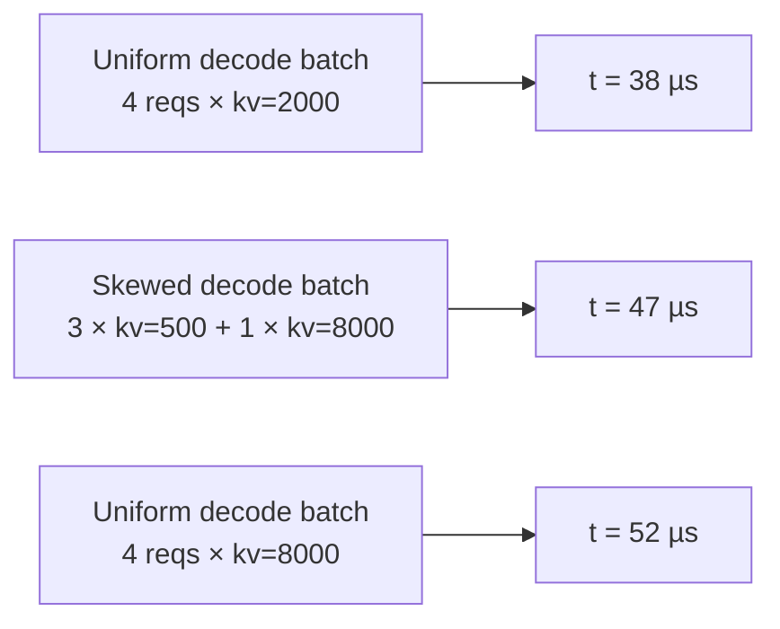

# Skew & alpha fit

The uniform attention sweep (`attention.csv`) profiles batches where
all decodes share one KV length. Real serving doesn't look like
that, every iteration mixes long-running requests at high KV with
freshly-arrived ones at low KV. FlashAttention's varlen kernel pays
a real penalty for that heterogeneity (tile-padding + SM-imbalance),
which the uniform grid can't see.

The skew sweep + alpha fit is how the simulator gets that penalty
right.

## The problem in one picture



Three batches with the same `n=4` decodes and the same **mean** KV
of 2000 (left and middle) or **max** KV of 8000 (middle and right).
The middle batch's latency lands between the two uniform reference
points, but where, exactly, depends on how skewed the KV
distribution is.

The naive interpolation `t = t(mean_kv)` underestimates the skewed
case (38 µs predicted vs. 47 µs actual). Using `t(max_kv)` would
overestimate (52 µs vs. 47 µs).

## The fix: blend toward a second lookup using a per-bucket alpha

For every shape of skewed batch, we measure the actual latency
**plus** what the uniform-mean and uniform-max latencies would be at
the same shapes. Three numbers per shot:

| Symbol | Batch shape |
| --- | --- |
| `t_mean` | Same `n`, all decodes uniform at the batch's **mean** kv |
| `t_max` | Same `n`, all decodes uniform at the batch's **max** kv |
| `t_skew` | The actual bimodal mix: `nb` decodes at `kv_big` + `(n - nb)` decodes at `kvs` |

From these three:

```
alpha = (t_skew - t_mean) / (t_max - t_mean)
```

Alpha is a **normalized position on the t_mean → t_max line**:

- `alpha = 0` → no penalty; skewed batch behaves like uniform-mean.
- `alpha = 1` → full penalty; skewed batch behaves like uniform-max.

`t_max > t_mean` is required, else the row is recorded as `nan` and the
fit skips it.

:::info[Raw alpha is not clamped to [0, 1]]
The name says "normalized", but nothing bounds the ratio, and the
measured data lands outside `[0, 1]` regularly. Across the six bundles
in `profiler/perf/`, per `skew.csv`:

| | range |
| --- | --- |
| p50 | 0.07 – 0.13 |
| p90 | 0.46 – 0.96 |
| rows with `alpha < 0` | 14 – 20 % |
| rows with `alpha > 1` | 2 – 5 % |

The two tails have different causes, and only one is noise:

- **`alpha < 0`** is mostly the endpoint gap sitting inside
  measurement noise. A shot with `t_mean = 941.7 us` and
  `t_max = 946.6 us` has a 4.9 us gap on a ~940 us baseline, so a
  `t_skew` 10 us below `t_mean` reads as `alpha = -2.16`. The
  magnitude is an artifact of dividing by a small number; the
  underlying signal is "no measurable penalty".
- **`alpha > 1` is real.** A skewed mix can genuinely cost more than
  *either* uniform reference, because tile padding and SM imbalance
  are not bounded by the uniform-max case. The largest row in the
  Qwen3-32B TP=1 bundle is `n=32, pc=2048, kv_big=16384, kvs=4096`
  at `t_mean = 19.1 ms`, `t_max = 19.3 ms`, `t_skew = 24.5 ms` -
  5.2 ms above uniform-max, so `alpha = 19.4`.

Nothing clamps a `skew.csv` row: the column keeps the `-2.16` and the
`19.4`, because both are measurements. What the *fit* applies is a sanity clip
on the constant a cell resolves to, `_ALPHA_CLIP = (-0.2, 1.0)` — an alpha
below `-1/lev` would drive the blended lookup negative, and the sweep's own
p10–p90 is `-0.04 … 0.82`, so a cell landing outside that is noise rather than
a regime.

Inside a cell the constant is the **median** of its rows' alphas, and that is
what keeps the tails from moving it at all: an isolated `-2.16` shifts the
median of 20+ rows by nothing, where a mean — or a `(t_max - t_mean)²`-weighted
fit, which up-weights exactly the rows whose gap is largest — would let it
through.
:::

At simulation time, the lookup becomes:

```
t_predicted = t_mean_lookup(batch.kv_decode_mean)
            + alpha(batch.shape) × (t_max_lookup(batch.kv_decode_max)
                                    - t_mean_lookup(batch.kv_decode_mean))
```

That's `_lookup_attention_with_skew` in
`serving/core/trace_generator.py`. It looks the batch up at its mean
decode kv and blends toward a second lookup at the max only when a
non-zero alpha applies -- otherwise the mean lookup is returned as is.

## Sweep structure (`skew.csv`)

The skew sweep produces `skew.csv` rows in two tiers:

### Tier 1, factorial over (n, ratio, pc, kp, kvs)

A factorial sweep at one representative skew factor (`_SKEW_REP =
4.0`). Provides the bulk of the rows, and covers the `(n, pc, lev)` cells the
fit discriminates on — `lev` comes out of each row's own two timings, so the
sweep populates it by varying `kvs` and `ratio` rather than by having an axis
for it.

Per axis:

- `n` ∈ unique values up to `MAX_NUM_SEQS`
- `ratio = nb / n` ∈ a few sample fractions
- `pc` ∈ prefill chunk grid (including 0 = pure decode)
- `kp` ∈ prefill-history grid
- `kvs` ∈ small-kv grid
- `skew` = 4.0 (fixed)

### Tier 2, skew-axis sweep at anchor pivots

At a handful of anchor pivots (a fixed subset of Tier-1 cells), Tier
2 sweeps `skew ∈ {1.5, 2.0, 4.0, 8.0, 16.0}`. This is the only
source of rows with `skew ≠ 4.0`; covers how `alpha` saturates as
the outlier KV stretches.

Tier 2 catches the "very long context decode joins a short-context
batch" failure mode that Tier 1 alone would miss.

## Density knobs

Four of the five *sweep* axes are user-controllable via per-axis geometric
factors in `profile.sh` (defaults `2.0` = doubling). `ratio` has no factor: it
is a unitless shape fraction rather than a scale, so a geometric coarsening of
it would not mean anything.

| Variable | Axis | Profiling time impact |
| --- | --- | --- |
| `SKEW_N_FACTOR` | `n` | doubling halves the shots |
| `SKEW_PC_FACTOR` | `pc` | same |
| `SKEW_KP_FACTOR` | `kp` | same |
| `SKEW_KVS_FACTOR` | `kvs` | same |

The skew sweep fires **3 shots per case** (`t_mean`, `t_max`,
`t_skew`), so coarsening compounds quickly. Bumping any factor to
`4.0` quarters the shots on that axis; `8.0` does it again.

The effective values land in `meta.yaml::skew_profile.factors`.

## The fit (`skew_fit.csv`)

Raw `skew.csv` rows are too granular to query at runtime, thousands
of `alpha`s, none of which match a runtime batch shape exactly. The
post-process groups rows into **cells** along three axes and takes the
**median** of each cell's per-row alphas.

### The 3-axis bucket key

Four, counting the kernel. Every key carries a `{layer}|` prefix naming which
attention-category kernel it was fitted on, and the fit runs **per kernel**.
That is not bookkeeping: a sparse-attention model puts two or three genuinely
different kernels in this category and their alphas disagree in sign. On the
same MiniMax-M3 batch the fit gives 0.24 for `attention`, **0.74** for
`indexer` — it scores the whole KV before the top-k, so it is the most
skew-sensitive thing in the model — and **-0.01** for `sparse_attention`, whose
block budget caps its work so its cost stops tracking kv length at all. Pooling
those into one alpha describes none of them.

| Axis | Bucket scheme |
| --- | --- |
| `layer` | The kernel, verbatim (`attention`, `sparse_attention`, `indexer`, …) |
| `n_label` | One bucket per profiled batch size, split at the **geometric midpoints** so a runtime `n` reads the nearest profiled size on a log scale: `n=2`, `n=4`, `n=8`, `n=16`, `n=32`, `n=64`, `n=128`, `n=256`, `n>256` |
| `pc_label` | Four coarse bins on the prefill chunk: `pc0`, `pcS` (≤256), `pcM` (≤1024), `pcL` |
| `lev_label` | Five fixed bins on `lev = (t_max - t_mean) / t_mean`, the endpoint gap in units of the batch's own cost: `lev0` (≤0.25), `lev1` (≤0.75), `lev2` (≤1.5), `lev3` (≤3.0), `lev4` |

These are the **literal strings** the fitter writes and the simulator
rebuilds, joined into `[{layer}|]{n_label}|{pc_label}|{lev_label}`, so they
have to match character for character. `n`'s edges depend on what the sweep
fired, which is why the simulator reads all three axes out of
`meta.yaml::skew_fit.bucket_axes` rather than hardcoding them.

`lev` is the axis that replaced three of the old five. It is not swept: it is
derived from each row's own two timings, and the simulator has both lookups in
hand before it needs an alpha — so it is free at both ends, and it already
contains what `kv_big` and the dispersion measures were saying separately.

### Why these three

The axes were chosen by running **every subset of six candidate axes end to
end** — 64 of them across the three committed bench examples, scored on all 15
metrics (TTFT / TPOT / latency × mean / p50 / p90 / p95 / p99). Summed
mean \|err\| over the three examples:

| Key | Summed mean \|err\| |
| --- | --- |
| `n \| pc \| lev` | **4.35** ← chosen |
| `n \| pc \| disp` | 4.43 |
| `n \| pc` | 4.55 |
| `n \| pc \| kp` | 4.82 |
| `pc(raw) \| n \| skew_rate \| kv_big \| kp` | 7.51 ← the previous scheme |
| `lev` alone | 8.5 |

`kv_big` and `disp` are already inside `lev`. `kp` acts only through the
additive prefill term the alpha algebra cancels — and real batches make the
point anyway: over all 470 mixed batches of the two dense examples its median
is **0**. `skew_rate` is noise; every subset containing it but not `n, pc`
lands in the bottom half.

Read that table for the *ranking*, not as a clean 3-vs-5 measurement: every
arm of it ran at the coarse `n` bins the section below replaces, so it ranks
axis sets under a defect all of them shared.

### The previous five axes could not be hit at runtime

That is the sharper statement, and it does not depend on the end-to-end score.
The five-axis key splits one sweep's 13,476 rows into **1,554 cells**, and the
cells real batches actually land in hold **2 to 5 rows each**. The three-axis
key makes **117 cells** from the same rows, and the ones real batches land in
hold **8 to 171**. So the old key has no usable setting:

| Keying | Cells hit by a real batch | p50 of \|err\|, Llama / Qwen3-32B | Lever-weighted \|err\| |
| --- | --- | --- | --- |
| `n \| pc \| lev` (this one) | **73% / 66%** | **1.6% / 3.1%** | **1.2% / 1.7%** |
| the five, with the 20-row floor | **0% / 0%** | 1.5% / 5.3% | 2.5% / 5.1% |
| the five, with no floor (what shipped) | 88% / 90% | 4.9% / 9.5% | 3.8% / 6.3% |
| no cells at all — the pooled constant | — | 1.5% / 5.3% | 2.5% / 5.1% |

Given a support floor the five-axis table is **numerically identical to having
no table**: not one of the 1,084 measured batches reaches a cell with 20 rows
behind it. Given no floor — which is what actually shipped, since the previous
fit had neither a floor nor a clip — it hits, but reads a cell fitted on two to
five shots, and its per-batch error is 3x the current one.

This is scored per batch rather than per cell, deliberately. Weighting cells by
a key the scheme itself defines rewards a finer key for having almost nothing
to score; joining on the batch does not. Each measured batch carries its own
`t_mean` / `t_max` / `t_skew`, so its true alpha and its lever in ms are known
without any key matching at all.

One honest wrinkle: on Llama the pooled constant's *per-batch median* (1.5%)
edges out the fitted table's (1.6%), while the lever-weighted measure prefers
the table two to one. That is the same concentration noted below — one cell
carries half of that run's whole skew lever — so the two statistics genuinely
disagree there. On Qwen3-32B the table wins on both.

:::note[The median, not a weighted least-squares fit]
WLS is the right objective when the noise on `dts = t_skew - t_mean` is
homoscedastic, because the charged error is `(a - a*) * dtm`. But `dts` is a
difference of two nearly-equal measurements, so its noise scales with `t_mean`
and weighting by `dtm²` over-trusts the few largest-gap rows — exactly where
one noisy shot dominates. Measured both ways through the whole pipeline, the
median wins on the sweep's own rows (Llama-3.1-8B `rel_err_p50`
0.0588 → 0.0308) *and* end to end.

That A/B held the axes fixed and swapped only the estimator, and it predates
the `n` fix below — so neither number is the shipped self-eval, which is
0.0259. See the accuracy table.
:::

### The `n` axis cannot be coarsened

Alpha differs **2.1–2.5×** between two adjacent profiled batch sizes, measured
at 42 coordinates with `nb` / `skew` / `kvs` held identical:

| | alpha at n=128 | alpha at n=256 |
| --- | --- | --- |
| Llama-3.1-8B TP=1 | 0.0531 | 0.0215 |
| Qwen3-32B TP=2 | 0.1119 | 0.0537 |

Every one of the 42 pairs has the same sign. And a run never schedules past
`max_num_seqs`, so a bucket spanning 128 and 256 charges real batches the
average of their own regime and one they can never enter. On Llama that cell
held 38 rows at n=128 (median 0.0589) and 37 at n=256 (0.0219), and its pooled
median came out **0.0258** — against the **0.0539** measured on 224 of the
run's own n=128 batches.

Scored against 1,084 batches measured on the live engine, the lever-weighted
alpha residual is **1.77%** of the two dense examples' spans with the sizes
pooled, against **0.21–0.26%** with one bucket per profiled size.

`pc` and `lev` are the other direction. Alpha's dependence on `pc` is a single
step at `pc = 0 → pc > 0` (Qwen3-32B 0.0674 against 0.023–0.026) and flat
above it, so swept at 2 / 3 / 4 / 5 / 6 / 8 bins and at
one-per-profiled-value the residual reads 0.71 / 0.49 / **0.51** / 0.50 / 0.48
/ 0.50 / 0.57% — the middle five are indistinguishable, and only one bin
(which loses the step) and one-per-value (which starves the cells) are worse.
Splitting `lev` finer only divides the support the same way.

An unfitted cell — fewer than 20 rows — falls back to
`alpha_default_by_layer[layer]`, that kernel's own pooled constant, and cells
that are written are clipped to `[-0.2, 1.0]`. It never falls back across
kernels, and a kernel with no skew data at all gets **no correction** — the
same behaviour as `SKIP_SKEW=1`, for the same reason: the endpoint gap is a
large fraction of an iteration, so a borrowed alpha is worse than none.

### Storage

- `skew_fit.csv`: the full per-cell alpha mapping, columns
  `layer, n_label, pc_label, lev_label, alpha, n_samples`. 74–109 rows for the
  bundled sweeps. The RTX 4090 bundle carries one too, kept in the same
  format, but its `meta.yaml` sets `skew_fit.enabled: false` — so the
  simulator never reads it and that configuration runs with no skew
  correction at all.
- `meta.yaml::skew_fit.per_tp[tp]`: summary per TP:
  `method`, `n_samples`, `alpha_default`, `alpha_default_by_layer`,
  `rel_err_p50/p90/p99`, `signed_mean`, plus a `bucket_table` pointer at
  `tp<N>/skew_fit.csv`.

This split keeps `meta.yaml` to ~100 lines per variant instead of
~3000+.

### Fit accuracy on the bundled profiles

Self-evaluation over each sweep's own rows — the fitted alpha against the
measured one, scored the way the simulator will use it:

| Bundle | TP | n_samples | rel_err_p50 | rel_err_p90 | rel_err_p99 |
| --- | --- | --- | --- | --- | --- |
| Llama-3.1-8B bf16 | 1 | 13,476 | 2.6% | 12.6% | 35% |
| Llama-3.1-8B bf16 | 2 | 13,302 | 2.6% | 13.2% | 35% |
| Qwen3-32B bf16 | 1 | 13,489 | 2.1% | 10.1% | 33% |
| Qwen3-32B bf16 | 2 | 13,469 | 2.5% | 12.2% | 39% |
| Qwen3-30B-A3B bf16 | 1 | 13,456 | 2.4% | 11.7% | 38% |
| Qwen3-30B-A3B bf16 | 2 | 13,271 | 2.5% | 12.6% | 38% |
| DeepSeek-V3.2-Exp fp8 | 1 | 62,996 | 0.4% | 13.3% | 41% |

:::caution[The self-eval got worse on purpose, and it is not an accuracy claim]
These numbers roughly **doubled** with this keying, and that is the point. The
previous fit wrote a cell for every distinct 5-axis coordinate with no support
floor at all — 3,952 to 21,665 cells over the same rows, i.e. **2.9 to 3.4
rows per cell** — so its `rel_err_p50` of 0.011–0.013 was measuring
memorisation. This one writes 75–109 cells at **175 to 578 rows each**, with a
20-row floor, and reads 0.021–0.026.

| | previous | now |
| --- | --- | --- |
| cells (Llama-3.1-8B TP=1) | 3,984 | 77 |
| rows behind each cell | 3.4 | 175 |
| `rel_err_p50` | 0.0126 | 0.0259 |
| lever-weighted residual on 1,084 held-out batches | 1.77% | 0.21–0.26% |

The last row is the one that decides it, because these score the fit against
the rows it was fitted on. What decides whether
the table is *right* is a held-out measurement: fire the batches a real run
actually built, at their exact kv lists, and compare. Three steps, and the
DEBUG `skew ...` line exists to make the first one possible — parse a
`--log-level DEBUG` sim log into a shots file for every corrected batch, fire
each on the live engine three ways exactly as `skew.py` defines them, and
weight each cell's error by the time the run puts through it. That last step
matters: on Llama-3.1-8B one cell carries 50% of the run's whole skew lever, so
a per-cell average is not the same statement. And a 20-batch ground truth is
not enough — it ranked two candidate keyings 2.34% / 0.25%, 209 batches said
0.77% / 0.52%, and only the complete 1,084 gave the answer the code now
carries.
:::

## Skip / refresh modes

| Variable | Effect |
| --- | --- |
| `SKIP_SKEW=1` | Skip the entire skew step. No `skew.csv` or `skew_fit.csv` produced. The simulator then applies **no skew correction** (`alpha = 0`) |
| `ONLY_SKEW=1` | Run only the skew step, leaving `dense / per_seq / attention / moe` untouched. Useful for refreshing skew after axis-density changes |

With no fit at all the simulator uses `alpha = 0`, i.e. `t_mean`
straight from the uniform grid. That under-predicts heterogeneous-decode
attention by a few percent, which is usually fine for a first-pass
sanity check. It is deliberately not a constant borrowed from other
hardware. Within a fit, buckets with no samples do fall back to that
fit's own pooled `alpha_default`, measured on the same GPU.

## Gotchas

1. **`skew_fit.csv` is bucket-keyed**, not raw-shape-keyed. A
   runtime batch with no matching bucket falls back to that kernel's
   `alpha_default_by_layer` entry. If your workload pushes shapes outside the
   profiled grid, expect those defaults to dominate, re-profile
   with wider grid bounds.
2. **A raw row is never clipped; a fitted cell is.** Measured p50 is
   0.07–0.13, but 14–20% of rows come out negative and 2–5% exceed 1, and both
   are real: a negative alpha means the skewed mix beat the uniform-mean batch
   (the endpoint gap can be inside measurement noise, and a block-capped sparse
   kernel genuinely gets cheaper), and above 1 means it cost more than
   uniform-max, which tile padding and SM imbalance do not bound. `skew.csv`
   keeps all of it; only `nan` rows — `t_max <= t_mean`, where the ratio is
   undefined — are dropped. The cell **median** is what stops a tail row from
   moving the fitted constant, and the constant itself is then clipped to
   `[-0.2, 1.0]`. The pooled `alpha_default` is not clipped, since it is a fit
   over every row rather than a cell.
3. **Skew correction only fires for non-trivial batches.** Pure
   prefill (`n_decode == 0`) and pure-uniform decode batches don't
   need correction, the uniform grid is already correct.
4. **MoE doesn't get skew correction.** The simulator's skew path is
   attention-specific. MoE per-rank latency is read directly from
   the 2D `(tokens, activated_experts)` table.
5. **A kernel with no skew data gets no correction, not a borrowed one.** The
   alpha is only worth applying if it is known to roughly ±0.02, because the
   endpoint gap is a large fraction of an iteration. Falling back across
   kernels would be worse than `t_mean`.

## What's next

- **[Output bundle → `skew_fit.csv`](./output-bundle#skew_fitcsv-skew-enabled-runs)**
  column-by-column reference.
- **[Simulator → Trace generation](/docs/simulator/trace-generation#heterogeneous-decode-skew-correction)**
  how the alpha is applied at simulation time.
