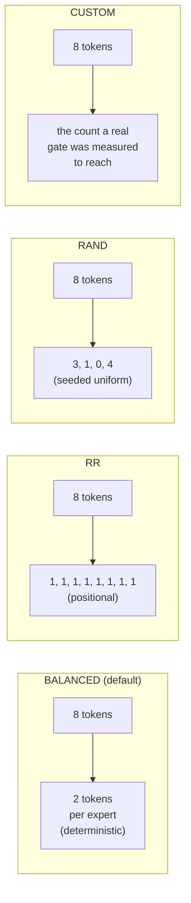

# MoE expert routing

For Mixture-of-Experts models, every token visiting an MoE layer
needs an answer to two questions: **which experts do I activate** and
**which EP rank holds them**. The first is the model's gate
function; the second is determined by how the simulator assigns
experts to ranks. This page is about both.

> Configuration angle (`--expert-routing-policy` flag, when to use
> which) is on **[Examples → Expert parallel](/docs/examples/parallelism/expert-parallel)**.
> This page is the internal mechanics.

## The piece that does it: `GateRouter`

`serving/core/gate_function.py` defines `GateRouter`. The trace
generator instantiates one per simulation; on every MoE block it
calls:

```python
GateRouter(
    num_local_experts=N,           # total experts in the model
    num_experts_per_token=K,       # top-K activations per token
    routing_policy='BALANCED',     # one of 4 policies, see below
    seed=42,
    block_copy=True,
)

result = router.route(num_tokens=T, tp_rank=r, num_experts_per_token=K)
# → RoutingResult(local_tokens=[...], activated_experts=[...], source_tokens=[...])
```

`local_tokens[i]` is the number of tokens assigned to EP rank `i`
after dispatch. `activated_experts[i]` is the count of distinct
experts touched on that rank. Both feed into the per-rank attention/MLP
latency lookup.

## Four policies



| Policy | Determinism | What it models | When to use |
| --- | --- | --- | --- |
| **BALANCED** (default) | Deterministic | Idealized load-balanced gate (post-aux-loss training) | Most research baselines |
| **RR** | Deterministic | Pure round-robin assignment | Sanity / null-baseline runs |
| **RAND** | Seeded random | Uniform random per token | Worst-case load imbalance studies |
| **CUSTOM** | Deterministic | The **measured** distinct-expert count of a real trained gate | Comparing against a real vLLM run |

### BALANCED, closed-form pigeonhole

BALANCED computes the *exact* token distribution that a perfectly
load-balanced gate would produce: for `T` tokens and `E` experts with
top-`K`, each expert gets `T*K/E` tokens (with the remainder split
deterministically across experts to round to integers).

This is what a model with a well-trained auxiliary load-balancing
loss converges to in expectation. It's the simulator's default
because:

1. Real production MoE deployments use auxiliary losses → balanced
   distribution is the realistic baseline.
2. It's deterministic, so simulations are reproducible.
3. It enables the **block copy** optimization (see below).

The number it actually needs is not "tokens per expert" but **how many
EP ranks one token reaches**, since that is what sets each rank's local
token count and the size of the EP collective. `_hit_probs` computes it
exactly, by
a DP over which groups the token selected rather than by sampling, so
the simulator stays deterministic. It draws **without replacement**,
matching `torch.topk`: a token picks `k` *distinct* experts. An earlier
closed form, `1 - ((ep-1)/ep)**k`, modelled `k` independent draws and
read about 1% low (Qwen3-30B at EP=8: 0.6564 against the exact 0.6674).

### RR, round-robin

Token *t* goes to expert `t % num_local_experts`. Same expert each
forward, regardless of token content. Useful as a sanity check or
when you want a "no smart routing" baseline; produces identical
per-rank token counts to BALANCED in expectation.

### RAND, random

Per-token uniform random across experts (using `seed=42` by default
for reproducibility). Produces realistic worst-case load imbalance
- some ranks see more tokens than others, which is what an
*untrained* gate produces. Use this if you want to study the cost of
load imbalance specifically.

### CUSTOM, the measured curve

BALANCED's closed form asks how many distinct experts a *uniform* gate
would reach. A trained gate concentrates on popular experts, so it
reaches fewer, and the concentration lives in the weights where no
closed form can get at it. Measured on Qwen3-30B-A3B over 110,640 real
gate calls: **0.87x** of the uniform model through the middle of the
range, **0.94x** at a saturated decode, and exactly **1.000** at one
token, where both readings are just `k`.

CUSTOM reads that measurement instead of deriving it. Record it with
[`bench run --record-gate-stats`](/docs/reference/bench-cli), which logs
what the real gate did and reduces it to one curve, then point the
simulator at the file:

```bash
python -m serving \
  --cluster-config configs/cluster/single_node_moe_dp_ep_instance.json \
  --dataset workloads/sharegpt-qwen3-30b-a3b-300-sps10.jsonl \
  --expert-routing-policy CUSTOM \
  --gate-stats bench/results/<run_id>/gate_stats.json
```

Against a real DP=1 vLLM run of Qwen3-30B-A3B on RTX PRO 6000, holding
everything else fixed:

| | TTFT mean | TTFT p50 | TPOT mean | span |
| --- | --- | --- | --- | --- |
| BALANCED (uniform closed form) | +8.3% | +6.5% | +6.0% | +4.8% |
| **CUSTOM (measured curve)** | **+2.8%** | **+2.1%** | **+1.9%** | **+0.3%** |

Nothing is fitted and nothing is interpolated across models. The curve
is linear between the batch sizes the recording run visited and clamped
at both ends: below the first point there is nothing under one token,
and above the last the count is bounded by `E` and the curve is already
flat there. `num_experts` and `num_experts_per_tok` are recorded in the
file and checked on load, because a distinct count means nothing without
them -- a curve from another checkpoint is refused rather than rescaled,
and the closed form takes over.

**A missing, unreadable or mismatched file falls back to BALANCED** with
one warning. That is deliberate: a guessed concentration is worse than
the closed form, which at least knows the right `E`.

Per-token call sites (`GateRouter.route`, used at EP=1 by nothing in the
simulator today) still go through `_custom_gate_function`, which is the
plug-in hook for driving routing from something else entirely.

:::note[Why not force the *truth* to be uniform instead]
A bench mode that replaced the real gate's assignment was tried, and it
does not answer this question. On a non-EP configuration under
cudagraphs it reads **0.700x** of the real gate's TPOT -- flattening the
per-expert histogram lands the grouped GEMM on a *different kernel
variant*. An in-situ profile of 8 real decode steps at matched batch
shape shows a `MoeFCGemm` template instantiation appearing with 144
calls and another dropping to zero, with attention unchanged as the
control. It cannot hold "everything but the count" fixed, so it measures
the schedule rather than the count. Measuring the count directly has no
such coupling.
:::

## Group-limited routing

DeepSeek-V3/V3.2 and GLM restrict a token's experts to `topk_group` of
`n_group` groups. `deepseek_v2.py` passes `num_expert_group=config.n_group`
and `topk_group=config.topk_group`, both defaulting to 1, and `GateRouter`
reads the same two fields off the checkpoint.

It matters because it narrows the set of ranks one token can reach, and
so the per-rank MoE token count and the collective that surrounds the
block:

| Model | `E` / top-`k` | `n_group` / `topk_group` | P(token reaches a given rank) at EP=8 |
| --- | --- | --- | --- |
| DeepSeek-V3.2-Exp | 256 / 8 | **8 / 4** | **0.454** — against GLM-5's 0.662 at the same `E` and `k`, a 31% cut |
| GLM-5 | 256 / 8 | 1 / 1 | 0.662 |
| Qwen3-30B-A3B | 128 / 8 | — | 0.667 |
| Mixtral-8x7B | 8 / 2 | — | 0.250 |
| Phi-mini-MoE | 16 / 2 | — | 0.242 |

Only DeepSeek-V3.2 actually restricts. GLM-5 ships `n_group: 1`, which
is the unrestricted case spelled out, and the other three do not
declare the fields at all — their spread comes from `E` and `k`, not
from grouping. The expression is verified
against a 400k-trial Monte Carlo on seven
`(E, k, n_group, topk_group, ep)` points and agrees within 0.0011,
which is the Monte Carlo's own noise.

The grouped and ungrouped cases go through the **same** expression on
purpose. Keeping the old approximation for `n_group == 1` would have
left two answers to one question.

Grouping changes the reachable set, not the batch's total work: a
balanced gate still spreads `T * K` expert-token pairs over every
expert, so the **activated experts per rank** is unchanged. Only
`local_tokens` moves.

## Expert-to-rank assignment

Whatever policy decides "token T goes to expert E", the simulator
also has to know "expert E lives on which rank". This uses **even
partitioning**:

```
GateFunction.expert_owner(e, ep_size, num_experts)
    = min(e * ep_size // num_experts, ep_size - 1)
```

So with 128 experts and `ep_size=2`, experts 0–63 live on rank 0 and
64–127 on rank 1. With `ep_size=4`, each rank holds 32 experts. The
`min(..., ep_size - 1)` is defensive — for a valid expert id the
division already lands below `ep_size` — but it keeps an out-of-range id
from indexing past the last rank.

The `GateRouter.route()` output collapses per-token assignments into
per-rank token counts that ASTRA-Sim consumes through the trace's
`EXPERT {i}` markers.

## `block_copy`: what it means and when it's safe

By default, `block_copy=True`. It is a **trace-generation** optimization, not
a trace-size one: the generator *builds* a block's rows once per distinct block
shape and appends that same list once per layer that shares it. The emitted
trace is the full per-layer thing either way — a 48-layer Qwen3-30B-A3B run
emits 583 trace lines with block copy on and 583 with it off. There is no
`block_copy` instruction in the trace or in Chakra.

What it saves is the per-layer latency lookups and size computations, which
dominate trace-generation time on a deep model.

This is **exact** for:

- Dense models (no MoE, every layer of a given block shape is identical).
- MoE with `BALANCED` (every block routes the same way, since
  BALANCED is deterministic and stateless).

It's an **approximation** for:

- MoE with `RR` (alternating round-robin position differs per layer,
  in practice the per-rank counts are still nearly identical).
- MoE with `RAND` (per-block randomness produces variance the copy
  can't capture).
- MoE with a `CUSTOM` per-token `_custom_gate_function` (depends
  entirely on what you wrote). The measured curve is deterministic in
  the batch's token count, so `block_copy` is exact for it, as it is
  for BALANCED.

For research where per-block variance matters, set
`enable_block_copy=False` in the trace generator (or pick a policy
where block_copy is auto-disabled). Trace generation runs more slowly and
every layer is built from its own router draw.

A heterogeneous stack never shares a block across differing layers, block copy
or not: the reuse is keyed on the layer's resolved block shape, so Qwen3.5's
gated-DeltaNet and full-attention layers are built separately even with the
optimization on.

## Per-rank latency lookup

Every rank's MoE block latency comes from
`profiler/perf/<hw>/<model>/<variant>/tp1/moe.csv` keyed on:

| Key | Meaning |
| --- | --- |
| `ep` | The instance's **total** EP degree — picks which grid to read |
| `local_tokens` | Tokens assigned to this rank after dispatch |
| `activated_experts` | Number of *distinct* experts this rank touches |

Profiled at TP=1 (expert weights shard by `ep_size`, not `tp_size`) but
**once per EP degree**, because a rank runs a slice of the block rather than
the block: `E/ep` local experts and `k/ep` of a token's k assignments. The
simulator does 2D linear interpolation across `local_tokens` and
`activated_experts` inside the chosen grid, and falls back to the nearest
profiled `ep` with a one-shot warning rather than interpolating across it.

This matters most in decode. `activated_experts` is the only lookup axis whose
minimum is a positive number the runtime can go under — it floors at `top_k`,
since a token cannot activate fewer experts than it selects — and the lookup
clamps below the grid instead of extrapolating. A GLM-5 EP=2 run asked for
`activated=4` against a floor of 8 in **98.4%** of its MoE lookups. Reading the
ep=1 grid there over-charges the MoE term by 1.7x to 4.8x depending on the
model and degree.

The full MoE block latency is then **max(rank_latencies)** because
ranks execute in parallel and synchronize at the surrounding
collectives. Whichever rank gets the most tokens × experts dominates.

## What the EP all-to-all costs

Each MoE block in the trace is sandwiched between the two halves of an
all-to-all:

```
input_residue → dispatch → expert compute → combine → output_residue
```

- **Dispatch**: routes input activations from each rank's TP shard to
  the rank holding their assigned expert.
- **Combine**: gathers expert outputs back to the originating ranks.

**In the trace these are `ALLGATHER` and `REDUCESCATTER`, not
`ALLTOALL`.** An MoE all-to-all is a logical operation with several
implementations, and vLLM picks one with `--all2all-backend`; its
default is `allgather_reducescatter`, described in vLLM's own option
list as "all2all based on allgather and reducescatter". The simulator
emits that pair, because ASTRA-Sim costs the collective it is handed.

They are sized differently, following ASTRA-Sim's `data_size`
convention for each collective:

| Half | Marker | `comm_size` |
| --- | --- | --- |
| Dispatch | `EXPERT 0` | `chunk * (hidden + num_experts) * fp` — the per-rank AllGather chunk, carrying the router logits alongside the hidden state |
| Combine | `EXPERT END` | `chunk * ep_total * hidden * fp` — the pre-scatter ReduceScatter total, hidden state only |

`chunk` is `(gathered - min) / (ep_total - 1)`, where `gathered` is the sum of
the group's per-rank token counts and `min` the smallest of them. Both
collectives are **ragged** — vLLM passes per-rank `sizes` through, and
`all_gatherv` is one broadcast per rank at that rank's own size — so a rank's
ingress is `gathered - sizes[r]` and the collective ends at
`gathered - min(sizes)`, the worst-off rank. With uniform sizes this reduces to
`gathered / ep_total`, which is what a CUDA-graph-padded decode round has; an
unpadded prefill round is where it differs, and charging the average there
under-priced the collective by up to 2x. See
**[DP+EP wave synchronization](./parallelism-mechanics#dpep-wave-synchronization)**
for when a round is padded.

Real lines from Qwen3-30B-A3B (`hidden 2048`, 128 experts, bf16) with
10 tokens at `ep_total 2`:

```
EXPERT 0 ALLGATHER:0,1 21760
expert            275789   LOCAL  40960  LOCAL  604504064  LOCAL  40960  NONE  0  NONE
EXPERT END REDUCESCATTER:0,1 40960
```

`5 * (2048 + 128) * 2 = 21760` and `10 * 2048 * 2 = 40960`.

For **DP+EP** topologies, the `comm_size` is synchronized to the max
across the DP group, see
**[Parallelism mechanics](./parallelism-mechanics)**.

## Gotchas

1. **`block_copy` defaults to True** and silently produces an
   approximation for non-BALANCED policies. If you're studying load
   imbalance specifically, disable it. It does **not** change the trace for a
   deterministic router — until v1.2.0 disabling it emitted a single
   transformer block instead of `num_hidden_layers`, understating the clock
   by 3.1x on a 48-layer model.
2. **`activated_experts` is per-rank, not per-token.** A rank with
   100 tokens hitting 8 distinct experts reports `activated_experts
   = 8`, not 800. The latency lookup expects this convention.
3. **MoE is profiled at TP=1.** Increasing `tp_size` doesn't change
   the MoE CSV path. Splitting expert weights happens via `ep_size`,
   which the simulator handles by adjusting the rank-to-expert
   mapping, not by re-profiling.
4. **`num_experts_per_tok` (top-K)** is read from the model's HF
   config. Deviating from the trained value is OK at simulation time
   but won't match the real model's behavior.
5. **Dummy batches in DP groups still route through the gate.**
   1-token dummy batches go through routing exactly like real
   batches, so DP+EP results are consistent across waves.

## What's next

- **[Parallelism mechanics](./parallelism-mechanics)**: what the
  collectives around the MoE block look like at the network level.
- **[Examples → Expert parallel](/docs/examples/parallelism/expert-parallel)** -
  the configuration angle (when to use which `ep_size`).
- **[Examples → DP+EP MoE](/docs/examples/parallelism/dp-ep-moe)** -
  multi-instance MoE.
