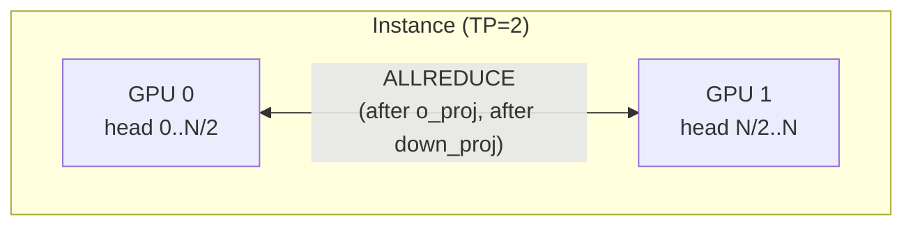
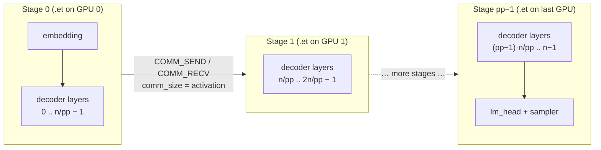
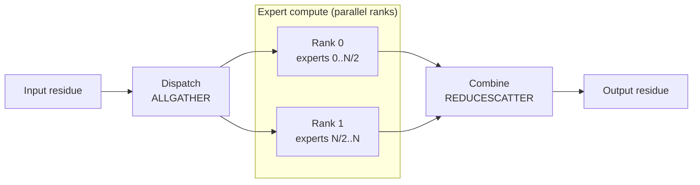
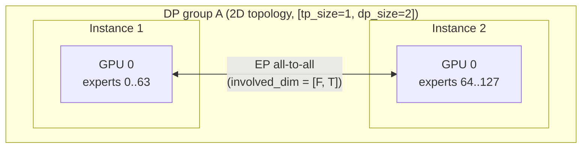
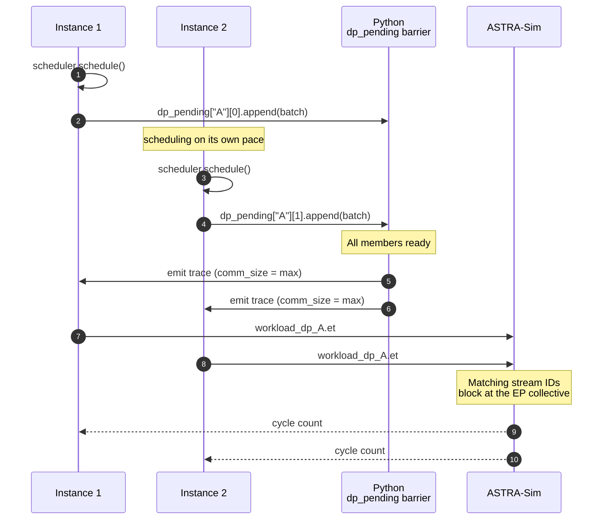

# Parallelism mechanics

This page is the **runtime** side of parallelism: when a batch hits
ASTRA-Sim, what collectives fire, where, and how multi-instance DP
groups synchronize. The cluster-config angle (which fields turn each
of these on) is on
**[Examples → Cluster config explained](/docs/examples/cluster-config-explained)**.

## What the simulator can model

| Style | What's parallelized | Collective | Where it fires |
| --- | --- | --- | --- |
| **TP** (tensor) | Linear and vocabulary weights partitioned across ranks | ALLREDUCE / ALLGATHER | Decoder projections plus shared target embedding/logits |
| **PP** (pipeline) | Decoder layers split across GPU groups | (point-to-point in `inflight` queue) | At stage boundaries |
| **EP** (expert) | MoE experts split across ranks | all-to-all, as ALLGATHER + REDUCESCATTER | Around the MoE block |
| **DP+EP** | EP across multiple instances | the same pair | Same, but across instance boundaries with wave-sync |

TP and EP can share the same GPUs. DP requires a `dp_group`
identifier on the cluster config — for a dense model that is plain data
parallelism, and for MoE it also spreads experts across the group.

## TP, ALLREDUCE on every dense layer



When `tp_size > 1`, the trace generator attaches an ALLREDUCE
`COMM_COLL_NODE` after each TP-aware dense linear:

- `o_proj` (attention output projection)
- `down_proj` (MLP output projection)

These are the two layers where each TP rank holds a different head
slice of the output and needs to sum across ranks.

The `comm_size` on each ALLREDUCE is the full output tensor size
(not per-rank, ASTRA-Sim divides internally based on
`nodes_in_ring`).

`qkv_proj`, `gate_up_proj`, etc. don't need ALLREDUCE because they
*split* the input along the head dim, those layers' output is
already correctly sharded for the next layer. TP's collective cost
includes `o_proj` + `down_proj`, two ALLREDUCEs per dense decoder block.

### Once-per-forward vocab-parallel endpoints

Two additional collectives run outside those decoder blocks in the ordinary
vLLM 0.28 target path. The catalog binding and shared placement are checked
before emitting either, and TP=1 emits neither:

| Endpoint | Collective | ASTRA-Sim payload |
| --- | --- | --- |
| Shared `VocabParallelEmbedding` | ALLREDUCE | scheduled tokens × hidden size × activation bytes |
| Shared `LogitsProcessor` | ALLGATHER | head rows × padded vocabulary / TP × head-dtype bytes |

The all-gather size is the **local vocabulary shard**, whereas the
all-reduce size is the full replicated hidden tensor. vLLM pads the ordinary
vocabulary to a multiple of 64 before dividing by TP. The sampler then reads
the full, unpadded vocabulary and is not TP-sharded. Its tensor dimensions,
and those of the logits head, use the per-sequence lookup row count rather
than all scheduled prompt tokens. Both endpoint collectives contribute to
link-energy accounting.

This implements `VocabParallelEmbedding.forward` and
`LogitsProcessor._get_logits`/`_gather_logits` for the default target path;
it is not a claim about local-argmax sampling, MTP, alternative heads or
expert dispatch/combine. Idle-DP head rows are a separate contract.

:::caution[MoE scope]
Target embedding/logits support does not validate expert dispatch/combine
or DP+TP expert-group sizing. In vLLM, an EP group spans TP × DP ranks;
a simulator configuration must match that layout before comparing timings.
:::

## PP, pipeline stages and `inflight`



When `pp_size > 1`, the scheduler keeps an `inflight` list capped at
`pp_size` entries. When the pipeline is full, `schedule()` returns
`None` and waits for ASTRA-Sim to drain a stage, the same
back-pressure pattern as Megatron-style 1F1B.

The trace header is stamped with `model_parallel_NPU_group: {pp_size}`
plus `pp_stage_boundaries`, the layer-row indices at which each stage
after the first begins. `trace_generator.py` computes them from the
transformer-block starts it just wrote, using the same partitioning
rule as vLLM's `get_pp_indices`: blocks split evenly, with any
remainder going to the stages *before* the last one, since the last
stage also carries `final_layernorm` / `lm_head` / `sampler`. Chakra's
`llm_converter.py` reads the boundaries and emits one `.et` per NPU. At
each stage boundary it pairs a `COMM_SEND_NODE` on the upstream NPU with
a matching `COMM_RECV_NODE` on the downstream one, sized by the boundary
activation tensor.

Stages are cut **only** on transformer-block boundaries. That is the
one place where the upstream layer's `output_size` and the downstream
layer's `input_size` are the same tensor — the hidden state, since a
block runs `layernorm` → … → `down_proj`/`moe`. Inside a block they
differ (`qkv_proj` emits Q+K+V, `rotary_emb` declares only Q+K), and
ASTRA-Sim's analytical backend keys its send/recv callback tracker on
`(tag, src, dst, chunk_size, chunk_id)` — so a size disagreement never
matches and the downstream NPU waits forever instead of raising. Cutting
the raw line count evenly used to land boundaries mid-block, which is
what made only some `pp_size` values hang.

`--enable-sub-batch-interleaving` is rejected with `pp_size > 1`: an
interleaved trace leaves both sub-batches mid-block at every group edge,
so a stage has no single hidden state to hand on.

Inter-stage P2P latency (link bandwidth, hop count, contention) is
therefore part of the reported iteration time, and pipeline overlap
between in-flight batches falls out from each NPU's independent `.et`
schedule.

## EP, the all-to-all around the MoE block



MoE dispatch/combine is a logical all-to-all. The supported vLLM
`allgather_reducescatter` path realizes it with gather/scatter collectives;
other backends require their own execution contracts.

### Deployment-matched native components

When a matching [native component table](../profiler/native-moe-components)
is installed, the trace keeps local gate/routing before dispatch, gathered
expert work between dispatch and combine, and local finalization afterward.
For the modular path, dispatch carries three distinct tensors:

| Tensor | Bytes per local row |
| --- | --- |
| Hidden states | `hidden_dim * input_dtype_bytes` |
| Top-k weights | `global_top_k * topk_weights_dtype_bytes` |
| Top-k IDs | `global_top_k * topk_ids_dtype_bytes` |

These are emitted as separate ordered AllGathers. Combine is a ReduceScatter
of hidden-state output. Sequence-parallel wrappers dispatch over EP and restore
TP output with an AllGather; non-SP wrappers dispatch within DP and restore
TP output with an AllReduce when TP is greater than one. The complete padded
DP token vector determines local/gathered rows, including SP ceil division.

Chakra chains every collective a marker carries and preserves the latest
compute/communication dependency through skipped expert ranks. Reinstall the
converter when updating this execution path; editing its source without
reinstallation does not change the installed converter.

For unequal dispatch counts the analytical envelope uses
`remote_rows = gathered_rows - min(dispatch_rows)`. With group size `G`,
a tensor of width `W` uses `ceil(remote_rows * W / (G - 1))` as its equivalent
AllGather local chunk; ReduceScatter uses that hidden-state chunk times `G`.
Equal counts recover the ordinary local chunk. This is a worst-rank Ring
approximation, not a claim that NCCL packs these tensors or executes grouped
calls as independent kernel startups.

### Retained whole-block fallback

Without a supported native table, the legacy path uses `moe.csv` and warns for
unverified DP/backend coverage. Its dispatch approximation combines hidden state
and full router logits into one AllGather payload. It does not become a modular
full-top-k measurement merely because its EP degree matches. Legacy lookup uses
gathered input rows and the appropriate global rank's activated-expert count;
these are not the unique local-token counts from a dispatch-routing histogram.

Ranks execute in parallel and synchronize at their collectives, so the slower
rank constrains progress. Separate component tables and operation-specific link
parameters do not remove that dependency or model other all-to-all backends.

Token routing decisions come from `gate_function.py`. See
**[MoE expert routing](./moe-expert-routing)** for the policies.

## DP+EP, wave synchronization





This is where the simulator gets clever. When two or more instances
share a `dp_group`, they form a single coordinated wave. Two
synchronization mechanisms work together:

### 1. Python-side `dp_pending` barrier

In `__main__.py`, `dp_pending` holds one **queue per DP-group member**
of batches waiting for their wave. Trace generation is **deferred** until
every member has at least one batch queued; the wave then takes the
oldest from each, so a wave always pairs the members' *j*-th batches —
the same pairing production serving gets, where DP rank A's *j*-th
forward joins the same collective as rank B's *j*-th. The queue matters
at `pp_size > 1`, where a member can have up to `pp_size` batches
outstanding at once. When a wave assembles:

- **Local graph padding comes first, including without DP.** Each rank
  selects a supported FULL or PIECEWISE graph and rounds its forward rows
  up to that graph's capture size. Small prefill/mixed batches can use
  PIECEWISE; prefill is not categorically outside the graph range.
- **DP synchronizes modes after local dispatch.** The common mode is the
  minimum across ranks. When it is non-NONE, all ranks use the largest
  locally padded size. When it is NONE, each rank **retains its local
  padding**, not its original unpadded count. With a grid containing 8 and
  ending at 256, `[6, 1529]` executes as `[8, 1529]`, not `[6, 1529]` or
  `[1529, 1529]`. A single independent six-token batch can likewise use
  eight forward rows.
- **Padding does not create requests.** Dense/model-forward work and its
  collectives use padded rows; attention lookup retains real query and KV
  geometry, and the head uses real selected rows. Zero-length graph padding
  is not a new decode with KV=1. Graph-bound attention-kernel behavior is a
  separate profiling concern, not a per-step timing correction here.
- **The MoE collective is sized from the gathered total**, the sum of the
  group's per-rank token counts — `max_total_len * dp_group_size` on a padded
  round, the plain sum otherwise. Each member contributes its post-padding
  forward rows. This is the simulator's aggregate dispatch/combine model,
  not an exact representation of vLLM's grouped, multi-tensor NCCL path.
- **Unequal per-rank sizes use a worst-rank analytical approximation**
  rather than an average-rank chunk. The emitted chunk is
  `(gathered - min) / (ep_total - 1)`. On a padded round that is exactly
  `gathered / ep_total`. Equal sizes can also occur without DP padding.
- All members of one round generate their traces with the same `comm_size`,
  which is what makes the collectives match across the group's `.et` files.

If one DP member has no pending requests, the scheduler synthesizes a
**dummy batch** (one decode query: one token, or `1 + num_speculative_tokens`
under speculation) so the wave still runs. When
all of one member's real requests have finished but the others
haven't, the dummy batches keep flowing until the whole group is
done.

#### Head rows are not graph-padding rows

Without speculative decoding, logits and sampling operate on one selected
hidden-state row per actual request, even when the backbone runs a larger
CUDA graph. Their latency lookup, tensor sizes and TP logits gather therefore
use the real request count, not the padded forward count.

An idle DP member still runs the backbone and its final norm to participate
in the coordinated wave, but does not compute logits or sample tokens. The
trace omits those per-sequence head operations and their energy costs. A
zero-byte terminal host store preserves the graph converter's output contract;
it does not represent CPU execution or fabricated sampled tokens.

This distinction does not change the existing speculative head/drafter
contract, profiling tables, attention lookup or network parameters. Idle
speculative drafter participation requires a separate collective-order audit.

Skipping a TP logits gather must not shift later EP messages. For collectives
described by `involved_dim`, the backend maintains an independent sequence
counter for each dimension scope and uses distinct tags for overlapping
scopes. Source and destination ranks distinguish disjoint groups. Counters
persist across batch graphs; exhausting the tag namespace fails explicitly
instead of wrapping onto an outstanding message. Explicit communicator
handling is unchanged.

Update and rebuild the ASTRA-Sim submodule together with this frontend
contract. A backend with one global collective counter can wait forever on
an EP operation after one DP member skipped a TP-only head operation. This
fix changes message matching, not bandwidth, latency or compute time.

A wave's graphs cannot be emitted at schedule time — the padded
`max_total_len` is not known until the barrier assembles — so each
member's graph is handed to the NPU that opened its round on that NPU's
next poll, ahead of anything the scheduler would otherwise start. That
keeps each NPU running its batches in the order they were opened, which
is what the completion bookkeeping assumes.

### 2. ASTRA-Sim collective barrier

All DP-group instances' `.et` files share the same workload folder
(`dp_<group>_batch<bid>/llm.et`) and use **matching stream IDs** on
the EP collectives. ASTRA-Sim's runtime sees the matching IDs
and blocks until both NPUs reach the collective, naturally
implementing the wave-sync at the network layer.

So both halves of the sync, Python deferral on submission, ASTRA-Sim
blocking on the collective, together produce a deterministic
wave-synchronous schedule.

## Multi-dimensional ASTRA-Sim topology and `involved_dim`

`config_builder` generates a multi-dimensional ASTRA-Sim network when DP
groups are present, innermost dimension first:
`npus_count: [tp_size, dp_group_size]`, or
`[tp_size, pp_size, dp_group_size]` when `pp_size > 1`. This mirrors
vLLM's rank layout, `all_ranks.reshape(-1, dp, pp, pcp, tp)`; the
`pp_size` dimension is omitted when it is 1, so DP+TP configs keep their
2-D topology. Collectives are scoped per dimension via the
`involved_dim` BoolList on each `COMM_COLL_NODE`:

- **TP-ALLREDUCE:** the TP dim only — `[True, False]`, or
  `[True, False, False]` with PP.
- **EP:** the DP dim, plus the TP dim when EP spans past one instance's
  GPUs — `[False, True]` / `[True, True]`, or `[False, False, True]` /
  `[True, False, True]` with PP. The PP dim is **never** involved:
  vLLM's EP group is `all_ranks.transpose(1, 2).reshape(-1, dp*pcp*tp)`,
  whose transpose pins the pipeline stage, so experts are sharded across
  the DP x TP ranks of one stage.

The `involved_dim` is encoded in the trace's `comm_type` field with
a `:dim0,dim1` suffix:

```
ALLREDUCE:1,0     # TP only
ALLGATHER:0,1     # EP dispatch across DP only
```

The Chakra converter parses this via `_parse_comm_type` and writes
the BoolList into the `.et` file. ASTRA-Sim's `Workload::issue_comm`
reads it and dispatches the collective only on the involved dims.

The `system.json` collective implementations need one entry per
topology dim, `config_builder` generates this automatically:
`"all-to-all-implementation": ["ring", "ring"]` for 2D.

## Communication sizes (ASTRA-Sim semantics)

The size convention depends on the collective:

- AllReduce takes the full replicated input size; Ring divides it into chunks.
- AllGather takes a per-rank input chunk, not the full gathered output.
- ReduceScatter takes the full pre-scatter input, not one rank's output.

Native MoE dispatch applies the AllGather convention separately to hidden state,
top-k weights and IDs, and combine applies the ReduceScatter convention to
hidden states. The retained fallback instead aggregates hidden/router-logit
bytes. Unequal DP counts use the analytical envelope described above.

Network bandwidth overrides must not alter these tensor sizes or local-memory
reduction charges. AllReduce retains its original operation's link settings
even through internal scatter/gather phases. See
[Collective-specific links](../reference/cluster-config#collective-specific-links).

## When to use which

A rough decision tree (the *configuration* angle is on
[Examples → Cluster config explained](/docs/examples/cluster-config-explained)):

- **Single GPU fits the model:** TP=1. Done.
- **Need more GPUs for memory:** start with TP. ALLREDUCE cost grows
  with `tp_size`, so going past 4-8 is rarely worth it.
- **Multiple replicas for throughput:** add `num_instances` (no
  `dp_group`). Independent instances behind a router.
- **MoE model, single instance:** add `ep_size = tp_size`. Same GPUs,
  the EP all-to-all replaces TP-ALLREDUCE on the MoE block.
- **MoE, want to scale experts past one instance's GPUs:** DP+EP
  with `dp_group` set. EP spans instances via wave-sync.
- **Dense model, want data-parallel replicas:** `dp_group` set and no
  `ep_size`. The replicas are wave-synchronized but share no experts.

## Gotchas

1. **`ep_size > tp_size` requires `dp_group`.** Otherwise the cluster
   config builder rejects the spec. EP needs the DP dimension of the
   topology to scale beyond a single instance's GPU count.
2. **Dummy batches are real ASTRA-Sim work.** A DP group with one
   idle instance still pays the collective's cost on the dummy batch.
   This is what production looks like, wave-sync is wave-sync.
3. **Local graph padding precedes DP synchronization.** Even a NONE
   common mode retains each rank's earlier local padding. The collective
   uses the sum of the resulting forward rows, not an unconditional group
   maximum. Target graph settings are [per-instance configuration](/docs/reference/cluster-config#cuda-graph-contract), independent of
   the profiler's eager settings.
4. **PP models inter-stage forwarding via send/recv, not via
   micro-batch splitting inside an iteration.** Activation shipment
   between stages goes through ASTRA-Sim send/recv (so link bandwidth
   and contention show up in the result), but a single iteration is
   not chunked into multiple micro-batches — the overlap benefit
   comes from running up to `pp_size` consecutive iterations
   simultaneously. There's also no knob to pick a pipeline schedule
   (1F1B, interleaved, etc.).

## What's next

- **[MoE expert routing](./moe-expert-routing)**: how tokens get
  distributed across EP ranks before the dispatch AllGather.
- **[Examples → DP+EP MoE](/docs/examples/parallelism/dp-ep-moe)** -
  a worked-out config that exercises this whole machinery.
