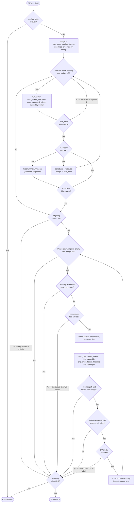

# Continuous batching

The scheduler is the heart of each serving instance. Every iteration
of the main loop calls `scheduler.schedule(current, sys)` and gets
back a `Batch` (or `None`). The scheduler enforces the same
constraints vLLM does: token budget, sequence count cap, and
optionally chunked prefill. This page walks through the rules.

> Need the configuration knobs? See
> **[Reference → CLI flags](/docs/reference/cli-flags)** for the flag
> list. This page explains *what each flag does internally*.

## Two phases, one scheduler

`Scheduler.schedule()` in `serving/core/scheduler.py` follows vLLM V1's
shape and runs in two phases per step:

| Phase | Queue | Behaviour |
| --- | --- | --- |
| A | `self.running` (persistent across steps) | Serve every running request. If one cannot get a block, preempt from the **tail** of `running` and retry. |
| B | `self.waiting` (arrival-ordered) | Admit while budget and sequence slots remain. Stops at the first request that cannot be allocated — phase B **never** preempts. |

Phase B is skipped entirely on any step that preempted. That anti-thrash
rule is what keeps the running set from oscillating
preempt → refill → preempt.

`--enable-prefix-caching` does not change the code path, only whether
blocks get indexed for reuse. There is one scheduler for both.

The constraints are:

- **Sequence cap:** `len(batch) <= --max-num-seqs`. Default `128`.
  Set to `0` for unbounded.
- **Token budget:** `sum(tokens_to_run_this_step) <=
  --max-num-batched-tokens`. Default `2048`.
- **Per-request cap (chunked prefill):**
  `tokens_for_this_request_this_step <= --long-prefill-token-threshold`.
  Default `0` = disabled.

Blocks come from the per-instance NPU `BlockPool`, whose
`num_free_blocks` is exact — an allocation either succeeds or reports
failure in the same call, which is what decides whether to preempt.
Details on **[Prefix caching](./prefix-caching)**.

## What the scheduler picks each step



Three things about the shape are load-bearing. **Phase B never
preempts** — every failure path there leaves the loop rather than
freeing someone else's blocks. **Phase B is skipped entirely on any
step that preempted**, which is what stops the running set oscillating
preempt → refill → preempt. And the whole thing is gated on a free
pipeline slot, so with `pp_size > 1` a step can return `None` purely
because every stage already has a batch in flight. All three mirror
vLLM V1's `schedule()`.

Note also what is *not* in the diagram: there is no prefill branch and
no decode branch. A request simply catches up to `num_tokens_reached`,
so `num_new` is 1 in steady-state decode and the whole remainder for a
resumed request. The trace classifies by scheduled token count after
the fact.

Conceptually, the loop is:

```
budget = max_num_batched_tokens
scheduled, preempted = [], []

# Phase A: requests already running
for request in running:
    if budget <= 0: break
    cap = tokens_to_catch_up(request, budget)
    while allocate_blocks(request, cap) failed:
        victim = running.pop()          # tail = lowest FCFS priority
        preempt(victim); preempted.append(victim)
        if victim is request: break
    if allocation still failed: break
    scheduled.append((request, cap)); budget -= cap

# Phase B: admit from waiting -- skipped entirely if anything was preempted
if not preempted:
    while waiting and budget > 0 and len(running) < max_num_seqs:
        request = waiting[0]
        hit = look_up_prefix(request)   # NPU blocks, then lower tiers
        cap = tokens_to_catch_up(request, budget, from=hit)
        if allocate_blocks(request, cap) failed: break   # never preempts
        waiting.pop(0); running.append(request)
        scheduled.append((request, cap)); budget -= cap

return Batch(scheduled) if scheduled else None
```

`tokens_to_catch_up` is one expression for every request state:

```
min(req.num_tokens_reached - req.num_computed_tokens,
    long_prefill_token_threshold or infinity,
    budget)
```

- **Prefill, no chunk yet:** prompt length minus any prefix cache hit.
- **Prefill, mid-chunk:** remaining prompt tokens.
- **Decode:** 1, because `num_tokens_reached == num_computed_tokens + 1`.
- **Resuming after preemption:** whatever neither tier could return.

## Chunked prefill

`--long-prefill-token-threshold N` (or `--enable-chunked-prefill`
which sets a sensible default) lets the scheduler split a long prefill
across multiple iterations. Without it, a single 32k-token request
hogs the whole budget and TPOT for other in-flight requests
collapses.

Concretely, a request whose remaining prefill is 8000 tokens with
`--long-prefill-token-threshold 1024` runs as eight separate
8x1024-token chunks across eight scheduler iterations. The
`Request.num_computed_tokens` field tracks progress; on each
iteration the scheduler bumps it by however many tokens were just
processed.

Decode steps continue to run *concurrently* in the same batch, the
chunked prefill just keeps long prompts from monopolizing.

## No prefill phase, no decode phase

There is no prefill-vs-decode branch in the scheduler, exactly as in
vLLM. A request simply catches up to the length it has reached:

```
num_new = req.num_tokens_reached - req.num_computed_tokens
```

which is 1 in steady-state decode, a chunk during prefill, and the whole
sequence for a request that was preempted and is recovering. The trace
classifies by the **scheduled token count** instead: more than one token
is a prefill chunk, exactly one is a decode. That is also how the
attention kernel sees the batch.

## Pipeline depth (PP)

For `pp_size > 1` instances, the scheduler also keeps an `inflight`
list of batches currently traversing the pipeline. Its length is
capped at `pp_size`: when the pipeline is full, the scheduler
returns `None` until ASTRA-Sim drains a stage.

This makes the simulator's PP behavior match production training
frameworks (e.g., Megatron) where micro-batches stream through the
pipeline.

## Where the scheduler stops

The simulator exits when, simultaneously:

- Every scheduler returns `None` (no eligible requests).
- `Router.has_pending_requests()` returns `False` (no future arrivals).
- `Router.has_deferred_sessions()` returns `False` (no agentic sessions
  waiting on tool calls).

If only the third is non-empty, the main loop fast-forwards `current`
to the next pending arrival time and resumes.

## What the scheduler hands back

`scheduler.add_done(npu_id, sys, current)` is called once per
iteration when ASTRA-Sim reports completion. It returns:

```python
(prompt_t, gen_t, end_reqs)
```

- `prompt_t` counts **all input tokens including prefix cache hits**,
  matching vLLM's reporting, which also counts cached tokens. The line
  in `add_done` is literally
  `prompt_t += num_new + req.prefix_cache_hit`, and it fires once per
  request, on the step its prefill completes.
- `gen_t` counts only newly generated tokens, incremented when a
  request catches up to `num_tokens_reached`. A resumed request
  recomputing its history contributes nothing here, so recomputation is
  never counted as generation.
- `end_reqs` is the list of requests that completed during this
  iteration.

For prefill instances under P/D disaggregation, the main loop hands
`end_reqs` to `router.transfer_prefill_request` so the
decode instance picks them up.

## Gotchas

1. **Prefill plus prefix caching** doesn't double-count: `hit_len` is
   subtracted from the tokens the scheduler actually runs, but
   *added* to `prompt_throughput`. So a 1000-token request with 600
   tokens of prefix hit consumes 400 tokens of budget and reports
   1000 tokens of prompt throughput.

2. **`--max-num-seqs 0` means unlimited**, not zero. Useful when you
   want pure token-budget gating, but watch memory.

3. **The token budget is shared across prefill + decode.** A batch
   with 64 in-progress decodes and a 1500-token prefill chunk runs
   1564 tokens this step. Decode contributions count.

4. **Pipeline parallelism caps `inflight` at `pp_size`.** Each
   iteration's layers are split across stages on transformer-block
   boundaries, with send/recv between them, so inter-stage P2P latency
   *is* modeled.

## What's next

- **[Prefix caching](./prefix-caching)**: how block hashes are chained
  and what a cache hit saves.
- **[KV cache & memory](./kv-cache-and-memory)**: how the scheduler
  knows when memory is full.
