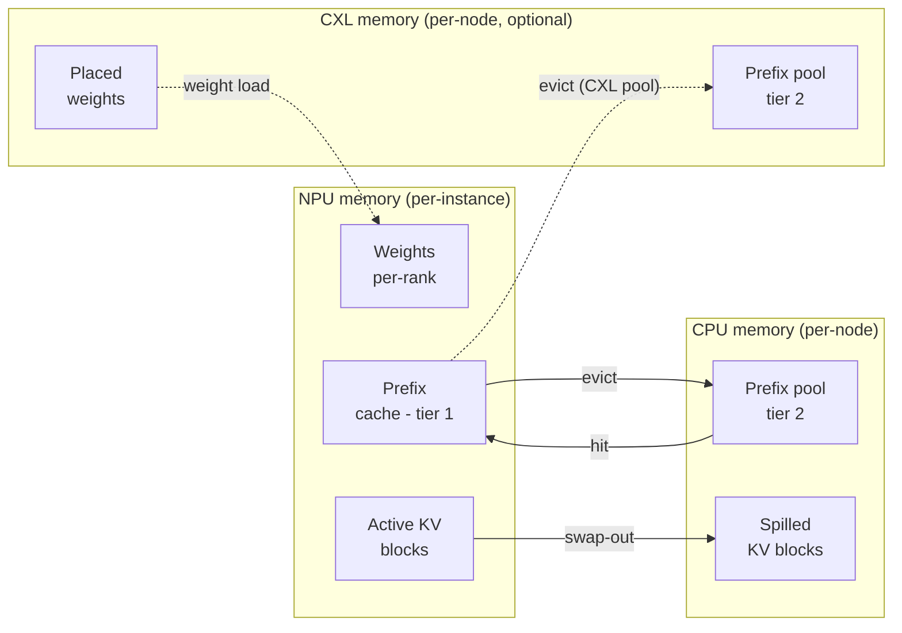

# KV cache & memory

Each `Scheduler` owns a `MemoryModel` that tracks how many bytes of
NPU and CPU (and optionally CXL) memory are in use at any moment.
This is what tells the scheduler when to stop accepting new requests
and what triggers prefix-cache evictions.

> Looking for memory-tier *configuration*? See
> **[Examples → CXL extended memory](/docs/examples/memory-tiers/cxl-memory)**
> for placement rules and
> **[Examples → Prefix caching](/docs/examples/memory-tiers/prefix-caching)**
> for the second-tier pool. This page is the byte-accounting side.

## Memory tiers



Three tiers, each represented by a separate counter on the
`MemoryModel`:

| Tier | Object | Capacity from | Holds |
| --- | --- | --- | --- |
| **NPU** | `npu_used` | `npu_mem.mem_size` × `num_npus` | Weights (per-rank), active KV cache, NPU prefix cache |
| **CPU** | `cpu_used` | `cpu_mem.mem_size` (per node) | CPU prefix pool, evicted KV blocks, model weight staging |
| **CXL** *(optional)* | `cxl_used[device_id]` | `cxl_mem.mem_size` × `num_devices` | CXL-resident weights / KV / prefix pool depending on placement |

Capacity comes from the cluster config; usage is tracked at runtime.
Exceeding capacity at startup (e.g., `weight_per_gpu > npu_mem`) is
a fatal error. Exceeding it at runtime triggers eviction (for the
prefix cache) or scheduler back-pressure (for active KV).

## What's in NPU memory

Two big consumers, in this order of priority:

### 1. Model weights (per-GPU)

Computed at scheduler init via
`MemoryModel.get_weight()`. The size is the model's full parameter
count divided by `tp_size` (and for MoE: experts further divided by
`ep_size`), times the dtype byte size:

```
weight_bytes_per_gpu = (
    dense_params / tp_size
    + moe_params / ep_size  # if MoE
) * fp
```

`fp` is 2 bytes for `bfloat16` / `float16`, 4 for `float32`,
1 for `int8` and `fp8`. Actually loading is done via `get_weight()`,
which reads the model config and accounts for shared embeddings,
tied weights, etc.

This bytes amount is reserved on every NPU at startup and never
freed. If `weight_per_gpu > npu_mem.mem_size`, the simulator exits
with a clear error message, the typical fix is to bump `tp_size`,
add CXL placement rules, or pick a smaller model.

### 2. Active KV cache

Per-request KV cache, tracked at block granularity. The block size
is `--block-size` tokens (default 16):

```
bytes_per_block = (
    2                                         # K and V
    * num_layers
    * num_key_value_heads
    * head_dim
    * block_size
    * kv_fp
) / num_npus                                  # = tp_size * pp_size
```

The divisor is `num_npus`, i.e. **`tp_size * pp_size`**, not `tp_size`
alone (`MemoryModel.get_kv()`). Both factors belong there: KV per layer
shards across TP ranks, and the layers themselves are split across PP
stages, so a rank in a `tp=2 x pp=2` instance holds a quarter of the
model's KV, not a half.

Note also that `head_dim` is read explicitly from the model config, not
derived — see **[Model config](/docs/reference/model-config)**. On Qwen3
`hidden_size / num_attention_heads` gives the wrong answer.

Where `kv_fp` is:

- 2 bytes for `bfloat16` / `float16` — what `--kv-cache-dtype auto`
  inherits from `--dtype`; 4 for `float32`.
- **1 byte for `--kv-cache-dtype fp8`**, which halves KV memory against
  a 16-bit weight dtype.

How many blocks exist is fixed at startup, the way vLLM sizes its cache:

```
requested   = npu_mem.mem_size * npu_mem.mem_util      # per rank
kv_bytes    = requested - model weight
num_blocks  = kv_bytes / bytes_per_block
```

`npu_mem.mem_util` defaults to `--npu-memory-utilization` (`0.9`), the
analogue of vLLM's `--gpu-memory-utilization`. vLLM additionally subtracts
its activation peak and CUDA context, which the simulator does not model,
so this capacity is an **upper bound** on vLLM's at the same fraction. The
run prints the resulting figure per instance under **KV Cache
Initialization** at startup:

```
  • Instance [0] : 585248 tokens / 36578 blocks (71.44 GiB/rank at util 0.90)
```

:::caution Calibrate `mem_util` when the KV cache is the binding constraint
`mem_util` only changes behaviour once a run actually **saturates** the KV
cache. Below that, the pool never runs out, nothing is preempted, and the
capacity you configured is invisible in the results. On a card with plenty of
headroom the default `0.9` is perfectly fine.

When a run does hit the ceiling, the number matters a great deal — and the
default is not the right one. Because the simulator does not model vLLM's
activation peak or CUDA context, `0.9` here buys noticeably more KV cache than
`0.9` does in vLLM. More cache means less preemption, so the simulated run
finishes early and every latency metric skews with it.

Set it from the measured run in that case. `python -m bench run` records what
vLLM actually resolved in `meta.json`:

```json
"kv_cache": { "num_gpu_blocks": 2588, "block_size": 16, "num_kv_tokens": 41408 }
```

Then pick the `mem_util` whose **KV Cache Initialization** line reports that
same block count. The bundled RTX 4090 / Llama-3.1-8B example is exactly this
case — 24 GB, pinned at its ceiling for most of the run — and the matched value
is `0.833919`, not `0.9`:

| | KV tokens | blocks | TTFT mean | TPOT mean | Latency mean |
| --- | --- | --- | --- | --- | --- |
| vLLM (measured) | 41,408 | 2,588 | — | — | — |
| `mem_util: 0.9` | 54,400 | 3,400 | -20.7% | +12.9% | -12.5% |
| `mem_util: 0.833919` | 41,408 | 2,588 | **+0.6%** | **+0.2%** | **+0.5%** |

Same profile bundle, same workload, same engine flags — only the capacity
differs. The bundled RTXPRO6000 examples, by contrast, peak at 58-97% of their
budget, so they are left at `0.9`: there is nothing for a calibration to
change. Read the peak `Each NPU Memory Usage` percentage off the heartbeat to
tell which case you are in — remember its ceiling is `mem_util * 100`, not 100.
:::

The scheduler takes `ceil(tokens / block_size)` blocks per active request
from the pool's free list, and returns them when the request finishes or is
preempted.

### 3. NPU prefix cache

Not a separate allocation. A block that becomes full is indexed under a
**chained hash** of its tokens, and it keeps that index entry after its
request returns it to the free list — so it is simultaneously reusable and
still findable. A later request whose prefix hashes the same way claims it
back instead of recomputing.

Eviction is therefore a **side effect of allocation**: when the pool hands
out a block from the head of its free list and that block still carries a
hash, the hash is dropped. There is no separate eviction pass and no
"evictable size" to estimate. With `--prefix-storage`, the block also has a
copy on the CPU or CXL tier, so a later request can still find it there.

Full mechanics: **[Prefix caching](./prefix-caching)**.

## What's in CPU / CXL memory

Per-node CPU memory (and per-device CXL memory) hold:

- The shared **second-tier prefix cache** if
  `--enable-prefix-sharing` is on.
- **Spilled KV blocks** from NPU evictions (when offloading is
  enabled).
- **Weights placed there explicitly** via the `placement` field in
  the cluster config (e.g., `"weights": "cxl:0"` for some decoder
  blocks on CXL device 0). See
  **[Examples → CXL memory](/docs/examples/memory-tiers/cxl-memory)**
  for the placement rule syntax.

Unlike NPU memory, CPU/CXL accounting is **per node**, not per
instance. Multiple instances on the same node share the same
`cpu_used` counter.

## How the scheduler uses this

The scheduler does not estimate. It asks the pool, and the pool either
hands over the blocks or reports failure in the same call:

```python
blocks = kv.allocate_slots(request, tokens_to_run_this_step)
if blocks is None:
    ...   # nothing was mutated; the caller decides what to do
```

`num_free_blocks` is exact, so a queued block *is* allocatable. That
all-or-nothing property is what makes the two callers behave differently
and correctly:

- **A running request** that cannot get a block causes a preemption: the
  scheduler drops the tail of its running set, returning that request's
  blocks, and retries.
- **A waiting request** that cannot get a block is simply not admitted this
  step. Admission never preempts, and it stops at the first failure.

Admission also refuses a request whose *whole* sequence would not fit, not
merely its first chunk (`--reserve-full-isl`, on by default, mirroring
vLLM's `scheduler_reserve_full_isl`). Checking only the first chunk lets
chunked prefill admit a request that then grows past capacity, which turns
into a preemption later.

Memory therefore sits at the pool ceiling once a workload has filled it,
rather than oscillating. A block in the free list that still carries a hash
is reusable data, not waste.

## Per-instance vs per-node accounting (gotcha)

The NPU block pool is **per-instance**. Two instances on the same node
have completely separate NPU accounting, even though they're on the same
physical GPU. `npu_used` is derived from the pool rather than tracked
alongside it, so there is exactly one ledger per tier.

`cpu_used` is **per-node**. Two instances on the same node share one
CPU memory budget. If both have spilled prefix blocks to CPU, they
compete for the same `cpu_mem.mem_size` capacity.

This matters for multi-instance configs: `num_instances: 4` with
each instance reserving 60 GB of NPU memory implies each instance
gets its own GPU; but they all share the node's `cpu_mem.mem_size`
GB of host memory.

## Reading memory in the throughput log

The heartbeat block emitted every `--log-interval` simulated seconds
carries one branch per instance and then one per node:

```text
[1.0s] Avg prompt throughput: 9069.0 tokens/s, Avg generation throughput: 224.0 tokens/s
        ├─Running Instance[0]: 9 reqs, Waiting: 0 reqs, Total # 1 NPUs, Each NPU Memory Usage 16486.51 MB (16.771 % Used), Prefix Cache Hit ratio 0.00 %, (0 / 9069)
        └─Node[0]: Total CPU Memory Usage 0.00 MB, 0.000 % Used
```

Reading the memory fields specifically:

- **`Each NPU Memory Usage`** is per rank, in **MB**, and covers weights
  plus active KV plus indexed prefix blocks — the whole `npu_used`
  ledger. The percentage is against `npu_mem.mem_size`, so it tops out
  near `mem_util * 100`, not 100.
- **`Node[i]: Total CPU Memory Usage`** is the node's lower-tier
  total. On a multi-instance node it is followed by each instance's
  share of that total, e.g.
  `(Instance[0]: 61.20 %, Instance[1]: 38.80 %)`.
- With `--prefix-storage CXL` a `CXL[...]` branch is added, one per
  device under `--enable-prefix-sharing` and one per prefix-caching
  instance otherwise.

Full field-by-field reference, including the multi-instance and CXL
variants: **[Reading the output](/docs/simulator/reading-output#heartbeat-block)**.

## Gotchas

1. **OOM at startup** is always a weights-vs-NPU-capacity issue. The
   error message points at exact byte counts; bump `tp_size` or
   reduce model size.
2. **OOM mid-run** is unusual but possible if CXL placement is
   misconfigured. Check the `CXL[...]` branch of the heartbeat block,
   which appears only with `--prefix-storage CXL`.
3. **`block_size` matters for memory granularity, not throughput.**
   Smaller blocks = finer accounting but more overhead per request.
   Default 16 is what vLLM uses.
4. **FP8 KV cache halves the KV byte budget**, but you also need a
   profile bundle for the `*-kvfp8` variant
   (e.g., `bf16-kvfp8`). Without it, the simulator errors out with a
   variant-not-found message.
5. **Weight memory is fixed for the run.** It doesn't grow when you
   add more requests; only KV cache does. The "weight ceiling"
   visible at the top of the throughput log line stays constant.

## What's next

- **[Trace generation](../trace-generation)**: how the latency for
  each iteration is calculated *given* a memory state.
- **[Examples → Prefix caching](/docs/examples/memory-tiers/prefix-caching)**
  and **[CXL memory](/docs/examples/memory-tiers/cxl-memory)**: the
  configuration angle.
