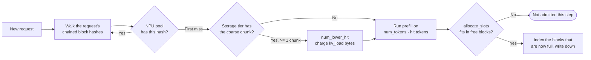

# Prefix caching

Prefix caching lets a request skip prefill work for tokens whose KV is
already resident. The mechanism is a port of vLLM v0.19.0's block pool:
blocks are identified by a **chained hash**, and a request that shares a
prefix with something already cached simply claims those blocks instead
of recomputing them.

> Looking for "how do I enable it" / "what flags should I set"?
> See **[Examples → Prefix caching](/docs/examples/memory-tiers/prefix-caching)**.
> This page explains the underlying block-pool mechanics.

## Chained block hashes

Each full block of `block_size` tokens gets a hash that folds in the
hash of the block before it:

```
h(0) = hash(SEED,   tokens[0:16])
h(1) = hash(h(0),   tokens[16:32])
h(2) = hash(h(1),   tokens[32:48])
...
```

Because the chain is cumulative, `h(i)` identifies *the whole prefix up
to block i*, not just that block's 16 tokens. So a lookup is a walk: try
`h(0)`, then `h(1)`, and stop at the first miss. Everything after a miss
is either uncomputed or gone, so there is nothing to check.

Two consequences worth knowing:

- **The recovered prefix is contiguous by construction.** A hole in the
  middle truncates the hit at the hole.
- **Only full blocks are cached.** The tail past the last block boundary
  is always recomputed — at most `block_size - 1` tokens, plus one more
  because the hit is capped at `num_tokens - 1` (the last token has to
  run to produce logits).

The hash covers `input_hash_ids + output_hash_ids`, so **generated**
tokens are cacheable too, not just the prompt.

## Tiers

Up to three `BlockPool`s per instance, looked up in order:

| Tier | Object | Lives in | Block size | Required? |
| --- | --- | --- | --- | --- |
| **NPU pool** | `MemoryModel.npu_pool` | NPU memory | `--block-size` (default 16) | Always, and indexed when `--enable-prefix-caching` (default) |
| **Storage pool** | `MemoryModel.storage_pool` | CPU or CXL | 256 tokens (LMCache's chunk) | Optional, `--prefix-storage` |

All tiers share **one key space**. A tier whose blocks are N times
larger keys on every Nth hash of the same chain — the last fine hash
each coarse block covers — so one walk over a request's hashes yields
both the NPU hit and the storage hit. No second hash function, no
separate index to keep consistent.

The NPU pool is **per-instance**: a request that lands on instance B
can't reuse a prefix cached on instance A.

The storage pool is **shared across instances on the same node** when
`--enable-prefix-sharing` is on. That's what makes prefix caching
useful in multi-instance deployments; without it, each instance has
its own private pool.

`--prefix-storage` selects where the storage pool lives:
- `None` → no storage tier (default; NPU pool only). This is plain vLLM.
- `CPU` → CPU memory (uses the node's `cpu_mem` budget).
- `CXL` → CXL memory (requires a `cxl_mem` block in the cluster
  config).

With a storage tier the simulator behaves like vLLM with LMCache or its
`OffloadingConnector` attached: the tier is **inclusive** (every block
that completes on the NPU is written down) and it drops the least
recently written chunk when it fills.

Writing down costs no latency — vLLM's `OffloadingConnector` defers it
to the next engine step on a dedicated stream precisely so it cannot
delay token generation — but reading back does, and that read is what
`kv_load` in the trace charges.

## Lookup flow



When the scheduler considers a waiting request:

1. `request_block_hashes(req, block_size)` builds the chained hashes,
   once, and caches them on the request.
2. Walk them against the NPU pool, stopping at the first miss →
   `num_npu_hit`. Those blocks are `touch()`ed, which pulls them out of
   the free list if they were eviction candidates.
3. If a storage tier exists, continue from there at *its* granularity:
   round the NPU hit down to a chunk boundary, count consecutive chunk
   hits, and take it only if at least one whole chunk is gained →
   `num_lower_hit`. Those bytes are charged as `kv_load`.
4. `num_new = num_tokens_reached - (num_npu_hit + num_lower_hit)`.
5. `allocate_slots` either reserves the blocks or returns `None`. On
   `None` the request is simply not admitted this step — admission never
   preempts anything.

Each component is recorded on the `Request`:

```python
request.prefix_cache_hit   # total hit
request.npu_cache_hit      # NPU pool only
request.storage_cache_hit  # NPU + storage
```

These show up in the throughput log line and the per-request CSV.

## What insertion looks like

`cache_blocks(req, num_tokens)` indexes every block of the request that
is now full, under its chained hash, and is idempotent — it tracks how
many are already indexed, so calling it after each chunk is free. Only
then can the *next* request with the same prefix hit. The first request
always pays the full prefill cost.

With a storage tier, the same call writes down any coarse chunk that has
become fully covered.

## Eviction

Eviction is a **side effect of allocation**, not a separate pass. When
`get_new_blocks` pops from the free list and the popped block still
carries a hash, that hash is dropped. There is no `evict()` call, no
"evictable size", and no reclaim step that can come up short.

Dropping a hash costs nothing, in any mode:

- the block belonged to a finished request → it was only a cache
- the block belonged to a preempted request and a storage tier exists →
  the copy is already downstairs, written off the critical path
- no storage tier → nothing was written down, so the request recomputes,
  which is exactly what vLLM does

A freed block goes to the **tail** of the free list, so it is reused
last. Requests free their blocks in reverse order, so under pressure the
tail goes first and the head — the recoverable prefix — survives longest.

## What preemption costs

A preempted request keeps nothing but its identity: `num_computed_tokens`
goes to 0 and its blocks are released. That is vLLM's own behaviour and
it is not a re-prefill, because the blocks keep their hashes. On
re-admission the lookup above finds whatever survived, and only the
remainder is recomputed:

| Situation | Cost on resume |
| --- | --- |
| Blocks still resident on the NPU | Nothing but the block-aligned tail |
| Blocks dropped, copy in the storage tier | `kv_load` transfer for the missing chunks |
| Blocks dropped, no storage tier | Recompute — counted in `Recomputed prompt tokens` |

## Block size across tiers

The NPU pool and the storage pool use **different block sizes**, and
that is deliberate rather than a rounding artefact:

- NPU pool: `--block-size` (default 16), matching vLLM's GPU block size.
- Storage pool: 256 tokens, matching LMCache's default `chunk_size`.
  A host tier wants fewer, larger transfers.

The storage size must be a multiple of the NPU size, because the tier
keys on every Nth hash of the same chain (N = 256/16 = 16). One
consequence to expect: a storage hit only ever extends the prefix in
whole 256-token steps, so a request with a 200-token prompt can never
hit the storage tier at all.

## What gets reported

Every iteration's `add_done` call updates these counters:

| Counter | Where you can actually see it |
| --- | --- |
| Per-request `prefix_cache_hit` / `npu_cache_hit` / `storage_cache_hit` | **Nowhere in the output.** Tracked on the `Request` object but not written to the per-request CSV. To get at it, read the objects directly or extend `Scheduler.save_output` |
| Per-instance hit ratio | The heartbeat's instance branch: `Prefix Cache Hit ratio 7.59 %, (19520 / 257239)`. **Cumulative since the run started**, not per interval |
| Shared lower-tier hit ratio | The same field on the heartbeat's `Node[i]` branch, but only with `--enable-prefix-sharing --prefix-storage CPU`, which makes the pool node-wide |
| Lower-tier pool occupancy | `Node[i]: Total CPU Memory Usage ...` or the `CXL[...]` branch, in MB and percent |
| Run totals, split by tier | The final **Prefix Caching Results** section: requested tokens, NPU hit tokens and ratio, the `<tier>` hit tokens and ratio when `--prefix-storage` is set, and the combined total |

There is no per-iteration hit counter and no NPU-versus-CPU breakdown in
the heartbeat: the per-tier split appears only in the final summary. See
**[Reading the output](/docs/simulator/reading-output#heartbeat-block)**.

## Gotchas

1. **Prefix caching is on by default.** Use
   `--no-enable-prefix-caching` if you specifically want a baseline
   without it (research baseline comparisons, etc.).
2. **The hash is over input token IDs.** If your dataset stores raw
   text and the simulator tokenizes them differently from your
   inference engine, hits won't match. Pre-tokenize (provide
   `input_tok_ids` in the JSONL) for stable hashing.
3. **NPU eviction is a side effect of allocation**, so memory sits at
   the pool ceiling once the workload has filled it. That plateau is
   normal — a block in the free list that still carries a hash is
   reusable data, not waste.
4. **The storage pool doesn't free itself on instance shutdown.**
   This is intentional (so a long-running multi-stage workload can
   keep reusing the pool), but leftover entries are visible in the
   final summary.
5. **Hits only ever come from complete blocks.** A resumed request
   always recomputes at least one token, and up to `block_size` (or up
   to a 256-token chunk when the recovery came from storage).

## What's next

- **[KV cache & memory](./kv-cache-and-memory)**: how the underlying
  block accounting works.
- **[Examples → Prefix caching](/docs/examples/memory-tiers/prefix-caching)** -
  the configuration / flag-level walkthrough.
