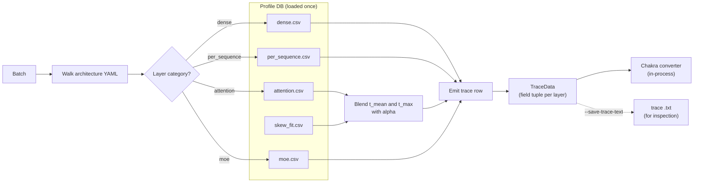

# Trace generation

`trace_generator.generate_trace(...)` is the bridge between the
**profiled latency database** (CSV files produced by the profiler)
and the **per-batch execution trace** that ASTRA-Sim consumes.

It's the page where "the model has 32 decoder blocks, each block has
qkv + attention + o_proj + mlp" turns into "this batch takes
1.78 ms".

> Looking for the trace file format spec? See
> **[Reference → Trace file format](/docs/reference/trace-format)**.
> Looking for how the profiler *produces* the latency database in the
> first place? See **[Profiler → Output bundle](/docs/profiler/output-bundle)**.
> This page is about how the simulator *consumes* it.



## The data the simulator consumes

The profiler writes per-category CSVs at:

```
profiler/perf/<hardware>/<model>/<variant>/tp<N>/{
  dense.csv,
  per_sequence.csv,
  attention.csv,
  moe.csv,           # MoE models only
  skew.csv,          # if heterogeneous-decode sweep is on
  skew_fit.csv       # ditto, the fitted alpha table
}
meta.yaml
```

Where `<variant>` encodes the dtype combination, e.g., `bf16` or
`bf16-kvfp8` or `fp8-kvfp8`. The simulator resolves it with
`resolve_variant(model_config)` — a pure function of the model config,
taking no dtype argument.

The CSVs hold `time_us` (microseconds). The simulator multiplies by
1000 and rounds to ns at load time, every internal latency is in ns.

## Loading the perf DB

`_load_perf_db(hardware, model, variant)` is called once per
unique `(hardware, model, variant)` triple over the simulator's
lifetime; results are cached in `_perf_db_cache`. Calling it on every
batch would be way too slow.

On first load, the simulator also:

1. Reads `meta.yaml` and compares the runtime's
   `--max-num-batched-tokens` and `--max-num-seqs` against the
   profiled sweep bounds. If you exceed them, you get a one-shot
   warning that lookups will **extrapolate** rather than clamp.
2. Validates and hydrates versioned skew calibration from `skew_fit.csv`.
   Enabled legacy fits are rejected; rebuild with `profiler refit-skew`.

## Per-category lookup

Each layer in the model's architecture YAML is tagged with a
**category**: dense, per_sequence, attention, or moe. Each category
has its own lookup function:

| Category | Lookup function | Key | Interpolation |
| --- | --- | --- | --- |
| `dense` | `_lookup_dense` | `total_len` (sum of tokens in batch) | 1D linear |
| `per_sequence` | `_lookup_per_sequence` | `num_requests` | 1D linear |
| `attention` | `_lookup_attention` | `(prefill_chunk, prefill_key, n_decode, kv_decode, decode_q_len)` | Linear bracket + blend on each axis |
| `moe` | `_lookup_moe` | `(local_tokens, activated_experts)` (per rank, profiled at TP=1) | 2D linear |

Every axis is bracketed by its two neighbouring profiled values and
blended on a linear scale.

`prefill_key = sum(c * (history + c / 2)) / sum(c)` weights each prefill
by its query count `c`, not by one vote per sequence. Empty prefills give zero.
Profiling and runtime use the same helper in `profiler/core/attention_shape.py`.
This preserves the continuous causal convention and does not claim that one
coordinate fully determines heterogeneous attention latency. For saturating
kernels, each effective key is capped before the weighted mean.

All lookups **extrapolate** outside the profiled grid (via linear
extension), so a runtime value larger than the largest profiled
sample doesn't fail, it produces a (less reliable) extrapolated
latency. The startup warning above tells you when this is happening.

The `time_us` value at each grid point is converted to ns at load
time, so lookups directly yield ns.

## Variant resolution

`resolve_variant(model_config)` mirrors the profiler's
`effective_variant`, but reads only the checkpoint — there is no dtype
flag on the simulator to read instead:

```
dtype           config_weight_dtype(config)
                  quantization_config.quant_method, else torch_dtype / dtype

kv_cache_dtype  config_kv_cache_dtype(config)
                  'fp8' if quantization_config declares kv_cache_scheme
                  or kv_cache_quant_algo, else 'auto'

variant         f"{short(dtype)}"                            # kv_cache_dtype == 'auto'
                f"{short(dtype)}-kv{short(kv_cache_dtype)}"  # otherwise
```

So one model config names exactly one folder:

- Llama-3.1-8B (`torch_dtype: bfloat16`) → `bf16`
- DeepSeek-V3.2-Exp (`quant_method: fp8`) → `fp8`
- a checkpoint declaring `kv_cache_scheme` → `bf16-kvfp8`

The profiler can still *write* other folders for the same model — its
`--variant`, `--dtype` and `--kv-cache-dtype` are how a deliberate
second precision gets measured and kept beside the first. The simulator
simply never asks for one.

If the resolved folder doesn't exist under `profiler/perf/...`, the
simulator raises a clear `FileNotFoundError` pointing at the missing
variant. Profile that model with the profiler's defaults, which name the
same folder.

## Heterogeneous-decode skew correction

The uniform attention grid uses one decode-history length per shot.
Heterogeneous histories can change latency, so the skew profiler measures
those batches separately. The default offline compiler fits corrections
against the same mean/max **lookup references** that serving will use:

```text
t_attention = t_mean_lookup + alpha * (t_max_lookup - t_mean_lookup)
```

The ordinary attention table, interpolation and query-weighted prefill
coordinate are unchanged. Pure prefill, one decode or uniform decode bypass
skew correction. For heterogeneous decode, both endpoints are needed to
compute the lever before choosing alpha, even when that alpha is zero.

New fits partition by kernel, decode query length, prefill-token bucket and
relative endpoint gap `lev = (t_max - t_mean) / t_mean`. Within a partition,
only sufficiently supported measured N values become anchors. Runtime picks
the nearest anchor on a log scale; exact midpoint ties go to the smaller N.
There is no interpolation between alpha cells.

N is support-adaptive; prefill boundaries scale with the measured envelope,
while leverage boundaries are dimensionless. They are stored in
metadata. Missing cells or out-of-range N use the same kernel/query pooled
fallback. A missing kernel/query fit means zero correction. There is no
model-specific fallback selection.

At profile load time, serving checks the bundle identity, attention and
fitted-table checksums, reference lookup fingerprint and saturation semantics.
A stale fit raises with instructions to run `profiler refit-skew`. After
loading, lookup is an in-memory partition selection and binary search;
it never refits or searches raw measurements in the simulation loop.

Enabled unversioned fits require rebuilding; disabled bundles are unchanged. Skipping skew
acquisition does not remove an existing calibration; a bundle with no enabled
fit uses zero correction. Neither endpoint reduction nor these empirical
buckets uniquely describe all request distributions, so validate changes
against all reported `bench/examples` statistics.

See [Profiler → Skew & alpha fit](/docs/profiler/skew-alpha-fit) for the
weighted-median objective, data contract, CPU-only rebuild and limitations.

## Walking the architecture YAML

Each model has an architecture YAML at
`profiler/models/<model_type>.yaml` — or at a YAML that lists its
`model_type` under `model_types:`, since one file serves a whole family
(e.g., `llama.yaml`, `qwen3.yaml` for both `qwen3` and `qwen3_moe`). The YAML
has:

- A `catalog:` mapping canonical layer names (e.g., `qkv_proj`,
  `attention`, `moe`) to vLLM class names.
- A `blocks:` describing what one decoder layer emits, keyed by axis, plus a
  `shared:` for what runs once per iteration:
  `shared.prologue → (attn.<type>.pre_attn → attn.<type>.post_attn →
  mlp.<dense|moe>) x num_hidden_layers → shared.head`.

Which block a given layer runs comes from the **checkpoint's own config**, not
from the YAML: `layer_types` decides the attention, `first_k_dense_replace` /
`decoder_sparse_step` / `moe_layer_freq` the MLP, `sparse_attention_freq` /
`index_topk_pattern` whether a sparse-selection branch applies.
`profiler/core/stack.py` owns those rules and both the profiler and the
simulator read it, so the two cannot disagree about a hybrid stack.

Blocks are built once per distinct block *shape* and replayed for every layer
that shares it, so trace generation stays O(1) in depth for a uniform model
while a heterogeneous one still gets the right block per layer.

`trace_generator._emit_sequence` walks a block's layer list and emits
one trace row per layer. It also:

- Attaches **TP-ALLREDUCE** after `o_proj` and `down_proj` when
  `tp_size > 1`. The ordinary shared target embedding also reduces once per
  forward; the shared logits head all-gathers vocabulary shards before
  sampling. Catalog bindings guard these endpoint collectives. Per-sequence
  tensor sizes use the head's lookup row count rather than total prompt tokens.
  See [parallelism mechanics](./parallelism-mechanics) for payload conventions.
- Wraps the MoE block with the **EP all-to-all** markers when MoE is
  active — emitted as `ALLGATHER` (dispatch) and `REDUCESCATTER`
  (combine), matching vLLM's default `allgather_reducescatter` backend.
- Swaps in PIM attention before the NPU attention kernel when
  `--enable-attn-offloading` is on.
- One-shot-warns when a sequence layer is missing from the profile
  CSVs (so you know to extend the profile).

## Where DP groups change things

When instances are in a `dp_group`, trace generation is **deferred**
until all DP members have scheduled their batches for the current
iteration. The simulator collects each member's `total_len`, takes
the **max** across the group, and uses that for both halves of the EP
all-to-all:

```
dispatch (ALLGATHER)    = max(total_len) / ep_total * (hidden + n_experts) * fp
combine  (REDUCESCATTER) = max(total_len) * hidden * fp
```

Each member's trace still uses its own per-instance `total_len` for
the dense and attention kernels, only the EP collectives are
synchronized.
This matches what production MoE serving does (vLLM CUDA-graph
padding to the max in the wave).

The full DP+EP wave-sync mechanics live on
**[Parallelism mechanics](./parallelism-mechanics)**.

## Block copy optimization

Layers that resolve to the same block shape produce identical trace rows — the
rows carry the canonical layer name, and the writer numbers the lines — so
building each one separately is wasted work. By default
`enable_block_copy=True`:

- **Build** a block's rows once per distinct block shape.
- Append that same list once per layer sharing the shape.

The emitted trace is unchanged: it still has every layer's rows. This is a
trace-*generation* optimization, saving the per-layer latency lookups and size
computations, and there is no `block_copy` instruction in the trace or in
Chakra. A 48-layer Qwen3-30B-A3B run emits 583 trace lines either way.

The reuse key is the layer's resolved block shape, so a heterogeneous stack
gets one built block per shape rather than one for the whole model — Qwen3.5's
gated-DeltaNet and full-attention layers are never shared.

Exact for dense models and for MoE with `--expert-routing-policy BALANCED` (the
default), which is deterministic, so every layer produces the same
`(local_tokens, activated_experts)` pair. For `RR` / `RAND`, per-layer variance
is small once the batch saturates, so block copy remains a harmless
approximation; `CUSTOM` policies that need per-layer variance can disable it
via `block_copy=False` in the gate router constructor.

## Per-rank latency for MoE

MoE uses `EXPERT {i}` / `EXPERT END` markers in the trace, with one
`COMP_NODE` per EP rank. Each rank's latency comes from the MoE CSV
keyed on its **local** token count and activated experts (profiled
at TP=1). Ranks execute in parallel and synchronize at the dispatch
and combine collectives.

Expert-to-rank assignment uses even partitioning:
`expert_id * ep_size // num_experts`.

## Gotchas

1. **`time_us` in CSV is microseconds.** The simulator converts to
   ns at load time. If you're cross-referencing a CSV row against
   a simulator log line, multiply by 1000.
2. **No calibration scaling.** Profiled latencies are used directly,
   not rescaled. If your profiles look off, re-profile rather than
   tweaking a "scale factor", there isn't one.
3. **First-load is slow** (perf DB parsing); subsequent loads hit
   `_perf_db_cache`. Restarting the simulator pays the parse cost
   again.
4. **Variant folder must exist.** A model config whose bundle was never
   profiled → `FileNotFoundError`. The profiler's defaults name the same
   folder the simulator asks for, so profiling the model is the fix.
5. **Skew correction only fires when the skew sweep was profiled.**
   Otherwise you get a single pooled alpha, which is correct on
   average but loses heterogeneity sensitivity.

## What's next

- **[Parallelism mechanics](./parallelism-mechanics)**: what
  TP-ALLREDUCE and the EP all-to-all actually look like in the trace.
- **[Reference → Trace file format](/docs/reference/trace-format)**
  the field-by-field spec of the text trace this page produces.
